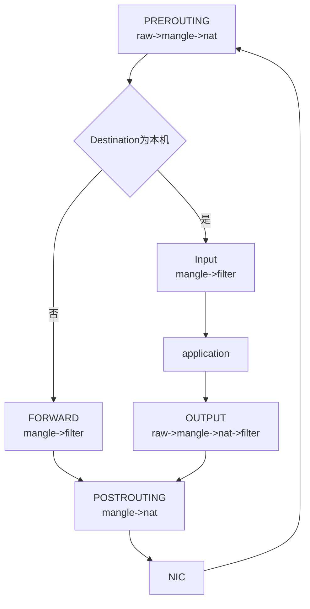

# debug_iptables

有些cni 如calico等还在使用iptables作为规则下发工具。

有的时候会出现丢包，这个时候就要去查看iptables，但这个工具列出的规则很抽象。

下面总结了常见的规则查看方法 和 debug 手段。

## IP tables 四表5链



注意，这只是一种典型实现。有的实现的链里面可能会有额外的表，比如说有点 input 链可能会有 nat表。具体情况具体分析。

比如通 `iptable -L -n -t raw` 就可以看出raw表所有的链。

- nat表: 会把一些nat规则放进来，通常在 prerouting, postrouting 的时候生效。也就是说路由之前把ip nat一下，让一个外部ip变成内部ip，然后在出网络的时候，再nat一下，让内部的ip变成外部的ip。
- raw表: 这个表一般没啥数据，通常在 PREROUTING 和 OUTPUT 链存在，可以用来做流量统计，TRACE 之类的。
- mangle表: 修改表，可以用来修改checksum之类的
- filter表: 过滤表，通常防火墙的实现在这里。这里就可以看到哪些流量会被reject/Drop掉等等。在 INPUT 和 FORWARD 以及 OUTPUT 三个点。

## IP rules 解析

结合着例子来看

```bash
[root@localhost ~]# iptables   -t filter -L -n
Chain INPUT (policy ACCEPT)
target     prot opt source               destination
LIBVIRT_INP  all  --  0.0.0.0/0            0.0.0.0/0
...

# 这里就是说，在 input 上，所有流量（前缀匹配）都到目标链 LIBVIRT_INP

# 使用下面的命令查看链上的数据，默认动作是pass
[root@localhost ~]# iptables   -t filter -L LIBVIRT_INP -n
Chain LIBVIRT_INP (1 references)
target     prot opt source               destination
ACCEPT     udp  --  0.0.0.0/0            0.0.0.0/0            udp dpt:53
ACCEPT     tcp  --  0.0.0.0/0            0.0.0.0/0            tcp dpt:53
ACCEPT     udp  --  0.0.0.0/0            0.0.0.0/0            udp dpt:67
ACCEPT     tcp  --  0.0.0.0/0            0.0.0.0/0            tcp dpt:67

```

再有一个例子，比如说在虚拟机场景, 虚拟机创建的vm的nic绑定到nc的br0（192.168.1.1/24）口上。

可以按照这个操作来绑定
```bash
ip l add name br0 type bridge
virsh attach-interface demovm2 --type bridge --source br0 --model virtio  #添加一块网卡，指定模式virtio网卡更快
ip a add 192.168.1.1/24 dev br0
```

也就是说 br0 作为虚拟网桥，连接vm 和 物理机。

假设现在通过qemu创建了一个vm，192.168.1.2/24, 一个场景是vm需要访问外部物理机器。

可以用 NAT 模式来实现这个功能（如果用过vmware，就知道了为什么它有个网卡模式叫nat模式）。

```bash
# vm发送到外界，比如说dns query 8.8.8.8，流量会从br0 口上收到, 进入 PREROUTING 链
# 但是这个ip不在物理机上，如果不开ip_forward，会直接被丢弃掉,所以首先将 net.ipv4.ip_forward 打开
sysctl -w net.ipv4.ip_forward=1

# 接下来，流量会依次经过 FOWARD 链，POSTROUTING 链
# 我们就在 POSTROUTING 链上操作，在nat表中添加一条 masquerade 动作
iptables -t nat -A POSTROUTING -s 192.168.1.0/24 -o bond0 -j MASQUERADE

# 这个动作的意思就是，如果源在 192.168.1.0/24 并且出口是 bond0(也就是物理节点上的默认路由出口)， 那么就执行 masquerade 动作
# masquerade 是对数据包进行伪装
# 具体的来说，将数据包的 源ip 和 port 进行 nat，然后记录到 conntrack 中
# 当外界的响应到时，在prerouting点通过conntrack将ip和port进行恢复，然后正常走后续路由流程

```
这样，两条命令，就完成了一个cni的一部分工作。

## iptables debug 

有的时候，tcpdump 能抓到包，但是应用又收不到数据。

知道就是 iptables 的规则导致，但是往往规则复杂，肉眼一时半会儿看不出来到底为什么丢包。

如果能够知道这个包经过什么流程，那就最好了，iptables 的trace模块就是解决了这个问题。

```bash
## 开启trace
modprobe ipt_LOG 2>/dev/null
modprobe ipt_TRACE 2>/dev/null

# 比如说抓 192.168.1.1 的icmp流量
iptables -t raw -I PREROUTING 1 -s 192.168.1.1 -p icmp -j TRACE

# TRACE 动作会把之后所有经过表/链以及动作都记录下来

# 之后可以通过下面命令来查看
dmesg | grep -i "TRACE:" -n
# 或者
journalctl -k | grep -i "TRACE:" -n

# 用完记得删除 TRACE 规则
iptables -t raw -D PREROUTING 1 -j TRACE

```