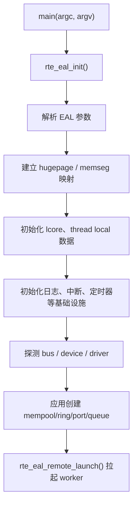

# EAL 初始化与 lcore/线程模型

DPDK 的入口看起来只是一个 `rte_eal_init()`，但它真正做的事情非常多：解析参数、建 hugepage 映射、初始化全局内存布局、探测总线和设备、拉起 worker lcore、准备日志/中断/定时器环境。

官方文档把这些都归在 EAL（Environment Abstraction Layer）下面。这个名字有点抽象，不过从工程角度看，它本质上就是 “把 Linux 用户态程序，整理成一个适合跑高速数据面的运行时”。

---

## EAL 到底管什么

如果不引入 EAL，应用本来只是一个普通的 `main()`。而 DPDK 程序启动后，马上要面对下面这些问题：

- 大页内存从哪里来
- 多个 lcore 怎么绑定 CPU
- PCI 设备什么时候探测
- `rte_ring`、`rte_mempool`、`rte_mbuf` 这些全局对象放在哪里
- 主进程和从进程怎样共享同一套 hugepage 映射

所以 EAL 的作用不是提供某一个功能点，而是先把“运行时地基”搭好，后面的库才能假设环境是稳定的。



---

## 初始化主路径

在 Linux 用户态下，进程先由 glibc 启动，随后进入 `main()`。真正的 DPDK 初始化入口是：

```c
int rte_eal_init(int argc, char **argv);
```

这个阶段通常会完成几件关键事：

1. 解析 EAL 参数，比如 `-l`、`--file-prefix`、`--proc-type`、`--huge-dir`
2. 建立 hugepage 映射，初始化 `memseg` / `memzone` / malloc heap
3. 初始化每个 lcore 的元数据，例如 lcore id、socket id、cpuset
4. 初始化 bus 层和 PMD 注册表，然后开始 probe
5. 把“当前线程”标成 main lcore

这里有一个很重要但容易忽略的事实：**绝大部分 DPDK 全局对象，都应该在 main lcore 上完成创建。**

官方文档明确提到，像 `memzone`、`ring`、`mempool`、`lpm`、`hash` 这些对象的 create/init 过程并不是多线程安全的。也就是说，它们设计出来就是让你在初始化阶段一次性建好，运行阶段高并发使用。

---

## lcore 不是 pthread 的别名

DPDK 文档里一直说 lcore。它并不是 Linux 内核里的 CPU，也不完全等价于 pthread，而是 EAL 维护的一层逻辑执行单元。

一个 lcore 至少包含这些信息：

- 逻辑编号
- 绑到哪个 CPU 集合
- 对应 NUMA socket
- 当前角色：main、worker、service core 等
- 该 lcore 关联的线程局部数据

从实现上看，EAL 最终还是调用 `pthread_create()` 和 `pthread_setaffinity_np()` 去拉线程、绑核；只是 DPDK 在上层再包了一层统一抽象。这样后续库只要看 lcore id，不必直接关心 pthread 细节。

常见启动代码通常像这样：

```c
rte_eal_init(argc, argv);
RTE_LCORE_FOREACH_WORKER(lcore_id) {
    rte_eal_remote_launch(worker_loop, arg, lcore_id);
}
rte_eal_mp_wait_lcore();
```

`rte_eal_remote_launch()` 的含义并不是“随便开一个线程跑函数”，而是“在已经由 EAL 管理好的 lcore 上切过去执行”。所以 lcore 生命周期和普通线程池模型不太一样。

---

## per-lcore 变量

DPDK 有不少数据是按 lcore 隔离的，例如 mempool 本地 cache、统计计数器、临时 scratch buffer。这类对象的关键目的都是一样的：**把共享写路径拆掉。**

如果多个 worker 每处理一个包都去更新同一个全局计数器，那 cache line 会来回 bounce；如果每个 lcore 都有自己的一份局部状态，热路径就会稳定很多。

所以在 DPDK 世界里，“每个 worker 一套私有资源”几乎是默认设计：

- RX queue 尽量一核独占
- TX queue 如果硬件不支持 lock-free，也尽量一核独占
- mempool cache 按 lcore 分片
- 统计通常先按 lcore 记账，最后再汇总

---

## EAL pthread 与非 EAL pthread

官方文档后来补上了对普通 pthread 的支持，但语义上还是要区分：

- EAL 线程：由 EAL 创建、分配 lcore 身份、可以直接参与典型数据面循环
- 非 EAL 线程：应用自己建的 pthread，默认不具备完整 lcore 上下文

这两类线程都能调用一部分 DPDK API，但不是所有设施都能无脑通用。例如某些依赖 lcore 本地 cache 的路径，如果线程没有完成注册，行为就会退化或者干脆不安全。

最保险的理解方式是：**DPDK 的快路径假设你跑在 EAL 管理的线程里。**

---

## 为什么 DPDK 强调 main lcore 初始化

因为它的设计哲学一直是：

- 初始化阶段可以复杂一点
- 数据面热路径必须尽量简单

这和普通业务系统很不一样。普通系统会把不少动态行为留到运行时解决，但 DPDK 更喜欢在启动时就把下面这些东西敲定：

- 哪些核负责什么
- 哪些对象放在哪个 socket
- 哪个 port 配多少 queue
- 哪些 offload 打开
- 哪些共享对象存在、叫什么名字

启动越“重”，热路径越“轻”。

---

## 使用时最容易踩的坑

### 1. 把对象创建分散到多个 worker

这通常不是好主意。`ring`、`mempool`、`ethdev queue setup` 之类的初始化最好集中在主线程完成，worker 只消费结果。

### 2. 以为 `-l` 只是绑核参数

它不仅决定 CPU 亲和性，还决定了 DPDK 认为哪些 lcore 是可用执行单元。后续 remote launch、service core、worker 分工都建立在这个集合上。

### 3. 混用普通 pthread 与 EAL 线程

如果线程模型没想清楚，经常会出现某些路径有 lcore cache、某些路径没有，结果性能和行为都变得不稳定。

### 4. 忽略 `--proc-type` 和 `--file-prefix`

单进程时感觉不到，一旦开始做 multi-process，这两个参数几乎是生死线。前者决定主从身份，后者决定是不是共享同一套运行时文件和 hugepage 区域。

---

## 一个更贴近工程的理解

如果把 Linux 看成“宿主环境”，那 EAL 就是在这个环境里先搭出一个“小型专用运行时”：

- 用 hugepage 建自己的内存版图
- 用 lcore 建自己的调度语义
- 用 bus/driver 框架建自己的设备发现流程
- 用 runtime files 建自己的多进程协作方式

后面的 `mempool`、`mbuf`、`ethdev`、`rte_flow` 都是跑在这个运行时之上的。

所以读 DPDK 时，EAL 不只是第一章，它其实是所有章节默认共享的前提。
