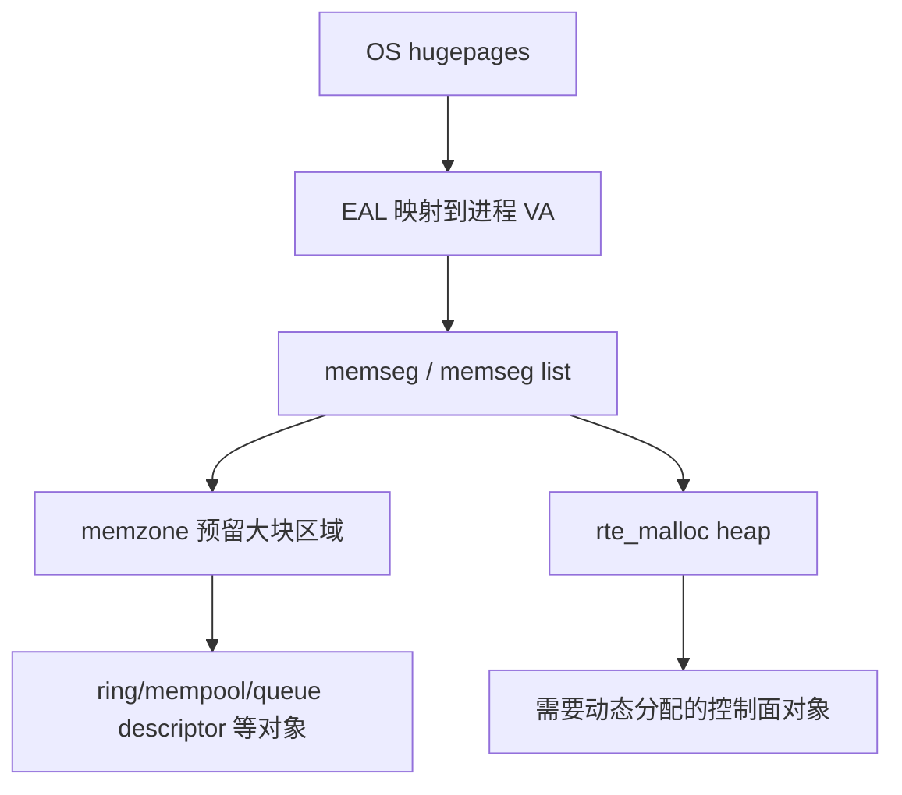

# Hugepage/内存子系统

DPDK 的内存管理有一个非常鲜明的特点：它不是在 libc `malloc()` 之上做一点优化，而是基本自己接管了一套大页内存映射、分段管理和对象分配体系。

这样做的原因也很直接。数据面既要高吞吐，又要可控的物理布局，还要尽量避免 TLB miss 和 page fault，普通用户态堆分配器很难满足这些要求。

---

## 为什么一定要 hugepage

先说结论：DPDK 并不是“喜欢” hugepage，而是很多能力离不开它。

- DMA 更容易获得稳定、可管理的地址空间
- 页数减少，TLB 压力更小
- 大块内存更容易做连续或伪连续映射
- 多进程共享时，映射关系更容易复现

对网卡来说，最重要的是数据缓冲区要能被设备可靠访问；对 CPU 来说，最重要的是热路径上的地址转换和 cache/TLB 抖动要尽量少。hugepage 同时照顾了这两件事。

---

## 从 hugepage 到 memseg

EAL 启动后，会先把系统里的大页映射进进程地址空间。映射完成后，DPDK 不会直接把这些页裸着给上层，而是整理成一套内部视图：

- `memseg`
- `memseg list`
- `memzone`
- malloc heap

可以把它理解成：

`memseg` 是底层物理页级别的管理单元，`memzone` 则更像“从这堆可用大页里预留一块带名字的稳定区域”。

---

## memzone 与 malloc 的边界

这两个接口经常被一起提，但它们关注点不一样：

### `rte_memzone_reserve()`

更偏“预留一块具名共享大块内存”。适合下面这些场景：

- NIC ring descriptor
- 需要跨进程共享的控制结构
- 对 IOVA 连续性有要求的区域

### `rte_malloc()`

更像 DPDK 自己的堆分配器。仍然可能来自 hugepage，但接口风格更接近常规动态分配。

如果你问一句“那是不是都用 `rte_malloc()` 就行”，答案通常是否定的。凡是要求名字稳定、生命周期长、可能跨进程可见、或者硬件直接访问的区域，`memzone` 往往更合适。

---

## dynamic memory mode 与 legacy mode

官方文档里把内存模式分成两类，这对理解很多启动参数非常关键。

### dynamic mode

这是现在更现代的模式。特点是：

- hugepage 使用量可以随申请增长/缩减
- 不一定天然 IOVA 连续
- 支持按需申请，不一定要启动时一次性吃满内存

这对普通应用比较友好，特别是内存需求变化大时。

### legacy mode

这是比较早期的行为模式：

- 启动时预留整块大页内存
- 更强调连续布局
- 运行期不会灵活增减

如果你的应用、驱动或者历史部署强依赖“启动时就把整片内存版图定死”，那 legacy 模式更接近老版本 DPDK 的心智模型。

---

## IOVA 连续不是“虚拟地址连续”

这是一个特别容易混淆的点。

- VA 连续：进程看到的虚拟地址连续
- PA 连续：物理地址连续
- IOVA 连续：给设备做 DMA 翻译后看到的地址连续

在现代 DPDK 里，真正和设备交互时，通常更关心 IOVA。官方文档也专门强调：如果你明确需要 IOVA 连续的大块内存，不要赌默认行为，应该显式使用带 `RTE_MEMZONE_IOVA_CONTIG` 的 `memzone` 预留。

---

## 共享文件、单文件段与多进程

Linux 下最常见的 hugepage 来源是 hugetlbfs 文件。EAL 会在挂载目录下建出 backing files，把每个大页或每组大页映射到进程里。

这件事和 multi-process 强相关，因为 secondary 进程并不是“复制” primary 的对象，而是**重新按同样的文件和同样的地址把共享内存再映射一遍**。

所以有几个参数一旦涉及多进程，就不再只是调优参数：

- `--file-prefix`
- `--single-file-segments`
- `--in-memory`
- `--huge-unlink`

它们会直接影响 secondary 能不能成功复现同一套映射关系。

---

## DPDK malloc 为什么不等价于系统 malloc

`rte_malloc` 不只是“快一点的 malloc”，它还带了 DPDK 特有的约束：

- 支持 socket / NUMA 亲和
- 可以控制对齐
- 背后走 DPDK 自己管理的 heap
- 最终可能仍然落在 hugepage 上

从工程上看，控制面里那些稍动态、但仍希望留在 DPDK 内存体系里的对象，通常会走 `rte_malloc`。而数据面对象，尤其是固定大小批量对象，更倾向于 `mempool`。

---

## 内存事件与限制器

新版本官方文档提到，dynamic mode 下可以注册内存事件回调和 allocation validator。

这意味着 DPDK 的内存版图不是完全静止的，某些系统组件可以观察“又映射了一批 hugepage”或者“又释放了一批 hugepage”。

但这里有一个非常实际的限制：**内存事件回调和 IPC 不应该互相套用。**

官方明确提醒过，内存回调里不要再做 IPC，也不要在 IPC 回调里去做内存分配/释放。这其实说明 DPDK 内部已经把这些机制编织得比较深了，随便重入很容易出事。

---

## 对性能真正有影响的几个点

### 1. NUMA 位置

远端 socket 访问的代价，在高包率场景下会被放大。最理想的情况是：

- 轮询该 NIC queue 的核在本地 socket
- 使用的 mempool 在本地 socket
- queue descriptor 也在本地 socket

### 2. 对齐与通道分布

早期官方文档对 x86 上内存通道/Rank 的对齐优化讲得很多。今天这个点没有以前那么“魔法”，但对象布局影响 cache 行和内存控制器分布，仍然是真问题。

### 3. 页粒度与文件数量

小页越多，文件描述符和映射元数据越多；对 vhost-user 这类要传共享内存文件描述符的路径来说，这会直接影响可用性。

---

## 常见误区

### 1. 以为 hugepage 只是“让 malloc 更快”

它远不止这个作用。它还是设备可访问内存、共享映射、TLB 行为和 IOVA 管理的基础。

### 2. 以为 dynamic mode 一定更先进

它更灵活，但并不等于在所有驱动和部署里都更稳。有些强依赖静态布局的场景，legacy 反而更直接。

### 3. 混淆 memzone、mempool、malloc

这三层分工不同：

- `memzone`：预留大块共享区域
- `mempool`：固定大小对象池
- `rte_malloc`：更通用的 DPDK 堆分配

---

## 一个实用的理解方式

DPDK 的内存系统可以粗暴地分两层看：

- 底层：先把系统大页组织成一个“可控的物理/IOVA 版图”
- 上层：再从这个版图里切出 `memzone`、heap、mempool，分别服务不同用途

一旦这样理解，后面再看 `mempool`、`mbuf`、descriptor ring、multi-process，很多设计就顺下来了。
