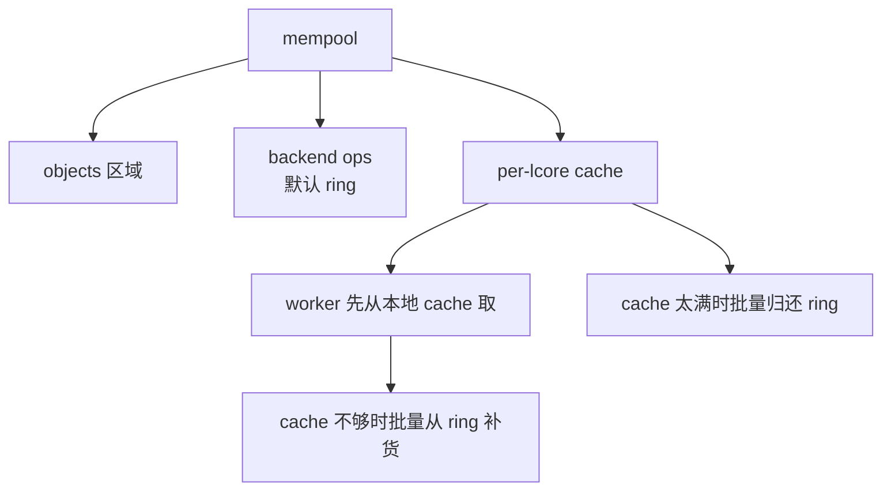

# mempool 机制

`mempool` 是 DPDK 最重要的基础设施之一。很多人第一次接触它，会把它理解成“固定大小对象的对象池”，这个理解不算错，但有点太轻了。

从数据面角度看，`mempool` 真正解决的是：**怎样在多核环境下，以尽量低的同步成本，把一批固定大小对象反复分配和归还。**

---

## 为什么 DPDK 这么偏爱固定大小对象

数据面最怕两件事：

- 动态分配带来的不可预测延迟
- 多线程分配器上的锁争用

网络包、描述符上下文、session 对象、临时工作单元，很多都可以抽象成固定大小对象。既然大小固定，那最直接的办法就是预先分好一大池，运行时只做 get/put，不做复杂堆管理。

这就是 `mempool` 的核心思想。

---

## 基本结构

一个 `mempool` 至少包含三层东西：

- 对象存储区
- 空闲对象管理器（默认是 ring）
- 每个 lcore 的本地 cache



这里最关键的不是 ring，而是“本地 cache + 批量搬运”。

---

## 热路径为什么快

如果每次申请一个对象都去碰全局 ring，那多核下会不断做 CAS，cache line 竞争会很明显。

`mempool` 的优化方式很朴素：

- 每个 lcore 先维护一小批本地对象
- 常规分配/释放只碰本地 cache
- cache 空了或满了，再批量和共享 ring 交互

这样就把“高频共享同步”变成了“低频批量同步”。

所以 `mempool` 的快，并不是因为 ring 神奇，而是因为大多数时候根本没碰到共享 ring。

---

## 创建时到底定了什么

常见创建接口：

```c
struct rte_mempool *rte_mempool_create(
    const char *name,
    unsigned n,
    unsigned elt_size,
    unsigned cache_size,
    ...
);
```

这里至少会定下几件事：

- 对象个数 `n`
- 每个对象大小 `elt_size`
- 每个 lcore cache 的大小 `cache_size`
- 对象初始化函数
- 这个 pool 放在哪个 socket

如果这个 pool 是给 `mbuf` 用的，后面还会在每个对象前面布上 `rte_mbuf` 头和数据缓冲区。

---

## 默认 handler：ring-based

官方文档现在把“mempool handler”单独拎出来讲，这一点很有意思。它说明 DPDK 在抽象上并不认为 mempool 必须绑死某种后端。

默认情况下，空闲对象管理器是基于 `rte_ring` 的。但理论上你完全可以换成：

- 特定硬件内存管理器
- 自定义外部 allocator
- 针对某类设备优化的 ops

这也是为什么创建新 handler 的方式是：

- 注册一套 mempool ops
- `create_empty`
- `set_ops_byname`

从架构上说，`mempool` 是“对象池抽象”，ring 只是默认实现。

---

## local cache 的意义不只是快

本地 cache 除了减少 CAS，还有两个附带效果：

1. 对象倾向于被同一个 lcore 再次拿到，局部性更好
2. 热路径的时延更平滑，因为不需要每次都走共享同步

当然副作用也存在：一部分对象可能会“躺”在某个 lcore 的 cache 里暂时不回流，看起来全局还有对象，但别的核拿不到。

所以 cache size 并不是越大越好。它本质上是在“共享效率”和“局部性/竞争”之间找平衡。

---

## debug cookie 和 stats

官方文档里提到两个调试选项：

- cookies
- per-lcore stats

cookie 会在对象前后加保护字段，用来抓越界写；stats 会统计 get/put 行为，而且通常按 lcore 分摊，避免统计本身又变成热点。

这两项默认都不是为极限性能准备的，而是为定位问题准备的。工程上遇到对象池损坏、双重释放、某个核分配异常时，它们很有帮助。

---

## NUMA 与对象池位置

`mempool` 是所有包缓冲区的上游，一旦它放错 socket，后面每个包都可能付出远端访问代价。

最理想的配法通常是：

- port 的 RX queue 绑定某个 socket 上的核
- 这个 queue 从同 socket 的 mempool 分配 mbuf
- TX 回收也尽量回到同一侧

否则你会看到一种很典型的现象：代码没错、burst 也不小、offload 也开了，但吞吐始终上不去，最后问题其实出在“每个包都跨 NUMA 拿 buffer”。

---

## `mempool` 与 `mbuf` 的关系

`mempool` 本身并不知道网络包，它只是管理固定大小对象。真正让它和网络强绑定的是 `pktmbuf pool` 这层封装。

也就是说：

- `mempool` 是通用对象池
- `pktmbuf_pool` 是“对象长成 mbuf 样子”的专用对象池

这一层分离非常有价值，因为 DPDK 很多别的对象也能复用 mempool 机制，而不必都发明一套自己的 allocator。

---

## 工程里最容易踩的坑

### 1. cache size 配太大

结果是对象都堆在某几个 lcore 本地 cache 里，看起来 pool 没空，但别的核取对象失败。

### 2. pool 放错 socket

这是比“算法写得不够 SIMD”更常见的性能问题。

### 3. 忽略对象大小的真实构成

有些对象看似只需要几十字节，但为了对齐、cookie、header、private area，实际占用远不止这么多。算容量时不能只看业务字段。

### 4. 把 mempool 当作任意大小对象分配器

它适合高频、固定大小、生命周期短的对象，不适合拿来替代所有控制面分配。

---

## 一个更贴近代码的理解

`mempool` 的设计其实很像 DPDK 整体风格的缩影：

- 对象先批量建好
- 分配路径尽量不做复杂逻辑
- 共享状态通过 per-lcore cache 削峰
- 后端实现保持可替换

所以后面读 `mbuf`、driver RX refill、TX free，都会看到 `mempool` 的影子。它不是某个普通库，而是整个数据面对象生命周期的起点。
