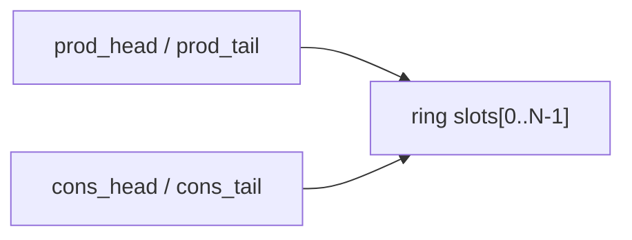

# ring / rte_ring

`rte_ring` 是 DPDK 里最经典也最常被复用的基础结构之一。`mempool` 默认用它管理空闲对象，pipeline 模型用它在线程之间传包，很多控制面异步队列也会直接拿它来用。

它的设计目标非常明确：**固定大小、无锁或低锁、批量友好、面向多生产者/多消费者。**

---

## 为什么不是链表队列

官方文档一开始就拿它和链表队列做对比，这个对比其实很关键。

链表队列的优点是大小灵活，但缺点也明显：

- 指针追逐，cache locality 差
- 每个节点都要单独管理生命周期
- 批量出入队不自然

`rte_ring` 反其道而行：空间固定，元素放在数组里，用头尾索引描述队列状态。这样一来，批量操作和 cache 友好性都会好很多。

---

## 基本结构

可以把 ring 理解成一个循环数组，外加两组指针：

- producer 的 `head/tail`
- consumer 的 `head/tail`

这里 head / tail 分成两对，不是为了好看，而是为了把“预留位置”和“真正提交结果”拆开。

---

## 单生产者/单消费者为什么简单

在 SP/SC 模式下，因为不会有多个线程同时竞争同一侧的 head/tail，出入队逻辑基本就是：

1. 读当前 head/tail
2. 判断有没有空间/数据
3. 推进 head
4. 拷贝对象指针
5. 提交 tail

这种情况下几乎不需要复杂原子操作，代码路径短，吞吐也很稳。

---

## 多生产者/多消费者的关键

一旦进入 MP/MC，真正的难点不是“把数据写进去”，而是“多个线程如何安全地抢到不重叠的槽位”。

DPDK 的经典做法是：

- 先读共享 head/tail 到本地
- 计算自己希望占用的区间
- 用 CAS 尝试推进共享 head
- 成功后写数据
- 再按顺序推进 tail

这里最核心的其实是：**head 表示 reservation，tail 表示 commit。**

如果只用一个指针，就很难同时表达“我已经抢到了这段空间”和“这段空间里的对象已经真的准备好了”。

---

## 为什么批量操作特别重要

ring 的很多 API 都有 bulk / burst 版本，这不是锦上添花，而是它高性能的关键之一。

- bulk：要么整批成功，要么失败
- burst：尽可能做，做多少算多少

批量操作的好处有两层：

1. 一次 reservation 可以覆盖多个元素，降低同步成本
2. 连续访问数组，比逐个节点操作更吃 cache

这也是为什么 DPDK 上层大量 API 都偏爱 burst 风格，`rx_burst`、`tx_burst`、mempool get/put 都是同一种设计语言。

---

## 32 位索引回绕

官方文档里专门讲了 “modulo 32-bit indexes”，看起来像细节，实际上很值得注意。

ring 的 head/tail 并不一定总在 `0 ~ size-1` 之间来回跳，而是让 32 位无符号整数自然递增，真正访问槽位时再拿 `mask` 截断。

这样做的好处是：

- 加减运算简单
- 回绕由无符号溢出自然处理
- 只要保证生产者和消费者距离不超过 ring 容量，差值就始终有意义

换句话说，它不是“每次都 modulo”，而是利用整数溢出语义把 modulo 成本藏掉了。

---

## 同步模式不止 MP/MC 与 SP/SC

新版官方文档又扩展了几类同步模式，比如：

- `MP_RTS` / `MC_RTS`
- `MP_HTS` / `MC_HTS`

这些模式本质上都在处理同一个老问题：**多线程竞争 tail 更新时，谁来等，谁来提交，怎么减轻 overcommit 场景下的等待放大。**

也就是说，ring 的核心算法虽然老，但 DPDK 还在持续微调它在不同部署条件下的表现，而不是把它当成一个完全静止的组件。

---

## ring 在 DPDK 里最常见的两个角色

### 1. 线程间传递对象

pipeline 模型里，某个 lcore 负责 RX，处理完或分类后把 mbuf 指针丢进 ring，另一边 worker 再取出来继续处理。

### 2. 作为更高层抽象的后端

比如 `mempool` 默认就用 ring 存空闲对象。上层看见的是对象池，底层真正管理 free list 的却是 ring。

这也是 DPDK 设计里很典型的“分层复用”：基础数据结构自己先打磨好，后面多个库都压在它上面。

---

## 什么时候 ring 不适合

它不是万能队列，至少有几个天然限制：

- 容量固定
- 空 ring 也要占满一整块数组空间
- 最适合传指针或固定宽度元素
- 如果生产消费速率长期不平衡，容易出现容量压力

所以对那种消息长度变化大、对象生命周期复杂、吞吐不稳定的控制面工作流，ring 未必是最省心的结构。

---

## 常见坑

### 1. 明明单生产者，却用了默认 MP

这样通常不会错，但白白多了一层同步成本。能确定单生产者/单消费者时，直接用 SP/SC 模式更合理。

### 2. 把 bulk 和 burst 混为一谈

bulk 更像事务语义，burst 更像“能拿多少拿多少”。上层回压逻辑不一样，不能随便替换。

### 3. 多核共享一个 ring 就以为没锁问题了

ring 只是把同步成本降下来了，不代表你的业务语义自动正确。比如对象生命周期、回收顺序、背压控制，还是要自己处理。

---

## 一个工程化理解

`rte_ring` 的价值，不在于它只是一个循环队列，而在于它把 DPDK 很多高频路径都统一成了同一种操作方式：

- 批量 reservation
- 批量提交
- 数组连续访问
- 尽量避免重量级锁

所以后面再看 mempool、pipeline、甚至部分驱动内部队列时，会一直看到它的影子。
