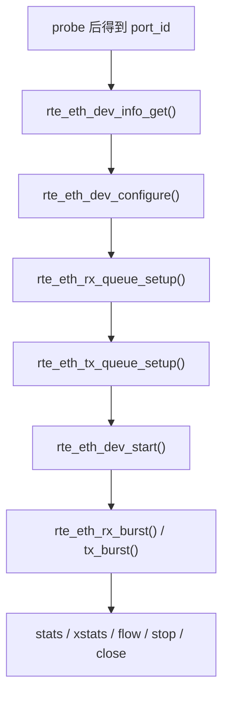

# ethdev 抽象

如果说 PMD 是“具体驱动”，那 `ethdev` 就是 DPDK 在网卡设备之上抽的一层统一模型。应用通常不直接碰 PMD 私有实现，而是通过 `rte_eth_*` 这一套 API 管理 port、queue、link、offload、stats。

这层抽象之所以重要，是因为它把“不同厂商、不同总线、不同虚拟设备”的差异，尽量收敛成了一组统一动作。

---

## ethdev 抽象的核心对象

`ethdev` 世界里最关键的几个概念是：

- `port`
- RX/TX queue
- device capability
- device configuration
- runtime stats / xstats

从应用角度看，典型流程总是这条线：

这条线其实就是 ethdev 给应用暴露的“设备状态机”。

---

## port 是什么

`port_id` 是应用层看到的设备句柄。它不等于 PCI BDF，也不等于 Linux 网卡名，而是 probe 完之后 DPDK 分配的一层逻辑编号。

这意味着：

- 应用热路径里用 `port_id` 很方便
- 真正定位设备身份时，还是要回到 PCI/BUS/driver 信息
- 多种设备类型都能被挂进同一套编号空间

官方文档也提到 port 还有一个 name，更多用于日志和调试。

---

## 为什么 queue 是一等公民

在 DPDK 里，端口只是一个入口，真正和 lcore 建立强绑定关系的是 queue。

原因很简单：高性能收发不可能靠多个核抢同一个全局入口，否则锁争用会把性能吃掉。所以最佳实践几乎总是：

- 一个 RX queue 只给一个轮询核
- 一个 TX queue 如果驱动不支持多线程无锁发送，也尽量只给一个核

这也是官方文档反复强调 “logical cores、memory、NIC queues relationship” 的原因。

---

## `rte_eth_dev_configure()` 真正在做什么

这个接口看起来像普通配置函数，实际上它是在定义“后续 port 要以什么能力模型运行”。

这里通常会敲定：

- queue 数量
- RSS / DCB / offload 需求
- RX/TX mode
- mtu、multi-queue 等行为边界

之后 queue setup 才会把每个队列的 ring size、socket、threshold、mempool 等具体资源钉死。

所以从依赖关系看，应该先配 port 级能力，再配 queue 级资源，最后 start。

---

## capability 先看，再配

`ethdev` 这层有一个很好的设计：先用 `rte_eth_dev_info_get()`、`rx_offload_capa`、`tx_offload_capa` 之类的字段把驱动能力拿出来，再决定怎么配。

这比“我猜这个网卡能开某个 offload，然后直接配”稳得多。

从工程上说，`ethdev` 的一个重要价值不是屏蔽差异，而是把差异显式暴露成 capability，让应用能有条件分支地适配。

---

## port ownership

官方文档比较新的一点，是把 port ownership 讲得更明确了。也就是一个 port 可以被某个 DPDK 实体声明拥有，用来避免多个组件同时管理同一设备。

这个机制背后的现实问题是：

- 一个应用里可能有多个模块想碰 ethdev
- 多进程场景下更容易出现资源归属混乱
- 某些库会在 probe/new event 后自动接手设备

ownership 不会自动解决所有同步问题，但至少把“谁有资格管理这个 port”这个语义明确下来了。

---

## on-the-fly configuration 的边界

不是所有配置都必须 stop device 再改。官方文档提到，有些功能完全可以在运行时通过寄存器路径或专门 API 动态调整。

但这里要非常小心，不同 PMD 支持差别很大。抽象层告诉你的只是“允许存在这种能力”，不代表每个驱动都能无缝支持。

所以真实工程里，凡是涉及：

- queue 重建
- offload 模式切换
- flow rule 与 device reconfigure 的交错

最稳妥的办法仍然是把生命周期管理得明确一点，不要过度依赖“热修改”。

---

## stats 与 xstats

`ethdev` 的统计接口分两层很好理解：

- 普通 stats：一组通用指标
- xstats：扩展统计，更多是 PMD/硬件特有计数器

如果只是做健康检查，普通 stats 往往够用；如果要排查队列级丢包、pause frame、特定硬件异常，xstats 才真正有信息量。

所以后面 telemetry 章节里 `/ethdev/xstats` 会很重要。

---

## 为什么 ethdev 抽象没有“把一切都统一”

这其实是它设计得比较克制的地方。

网卡硬件差异非常大，如果强行把每个特性都完全统一，就只会得到一层过于贫瘠的最小公倍数 API。DPDK 的选择是：

- 公共收发和配置动作统一
- 能力差异用 capability 暴露
- 更复杂的匹配/转发/隧道等，交给 `rte_flow` 等扩展接口

这比“假装所有网卡都一样”更实用。

---

## 常见坑

### 1. 没看 capability 就直接开 offload

轻则配置失败，重则行为不符合预期。

### 2. 多核共享 RX queue

这几乎总是错误方向。RX queue 最好一核一队列。

### 3. 把 port 配置和 queue 配置混在一起想

先想清楚设备级能力，再去想每个队列的资源，不然很容易在 `dev_configure`、`queue_setup`、`start` 之间来回试错。

---

## 一个更实用的理解

`ethdev` 本质上是在 PMD 之上提供了一套“可移植的网卡控制平面接口”。

它不负责把所有驱动差异都消灭掉，而是负责让应用在大多数情况下：

- 用统一 API 管设备
- 用 capability 看差异
- 用 queue 建立和 lcore 的高性能绑定

理解这一层之后，再看 PMD 就不会觉得它只是“更底层的一堆代码”，而是能看清它和应用之间的边界。
