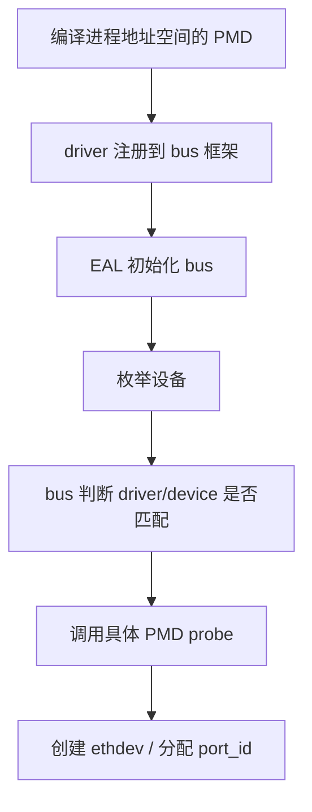

# PMD 驱动加载与探测

DPDK 应用启动后，设备不会凭空出现成 `port_id`。中间还隔着一层 bus、driver、class、probe 的流程。`ethdev` 只是把最终结果统一暴露出来，而设备是怎么被发现并接进来的，要看 PMD 探测链路。

这一章最值得弄清的不是某个厂商驱动细节，而是 **DPDK 如何把“驱动注册”和“设备枚举”拼起来。**

---

## 先有 driver，再有 probe

PMD 探测的第一步，不是扫描硬件，而是先把驱动自己注册进框架。

无论是 PCI PMD、vdev PMD 还是其他 bus 设备，通常都会在编译/链接后通过构造器宏或注册宏，把自己的 driver 对象放进全局驱动表。等 EAL 初始化 bus 框架后，这些 driver 才有机会参与真正的匹配。

粗略看可以理解成：



---

## bus 是探测的第一层分发器

DPDK 不是只支持 PCI，所以它没有把 probe 流程硬编码成“扫 PCI 再调驱动”，而是抽了一个 bus 层。

常见的几种设备路径：

- PCI 设备：真实 NIC，最常见
- vdev：纯软件/虚拟设备，例如 `virtio_user`、`net_pcap`、`net_ring`
- auxiliary / platform 等其他总线类型

bus 层负责两件事：

- 怎么枚举“候选设备”
- 这个设备该交给哪个 driver 去 probe

所以后面 PMD 自己的 `probe()`，通常已经拿到了一个基本匹配过的设备对象。

---

## PCI PMD 的典型路径

对 PCI 网卡来说，常见流程是：

1. EAL 初始化 PCI bus
2. 扫描系统 PCI 设备
3. 根据 vendor/device id 与各 PMD 的 id table 做匹配
4. 选中 driver 后调用其 probe
5. driver 建私有 `dev_private`、映射 BAR、初始化硬件
6. 挂进 ethdev，得到 `port_id`

真正决定“这个设备是不是我来管”的，通常是 PMD 自己声明的设备 ID 表，而不是应用层逻辑。

---

## vdev 路径和 PCI 很不一样

`--vdev` 这种设备没有真实硬件枚举过程，更多是“你在命令行上声明一个虚拟设备实例，EAL 在启动时按名字去找对应 vdev driver，再让它 probe”。

例如：

```text
--vdev 'eth_vhost0,iface=/tmp/sock0'
--vdev 'virtio_user0,path=/var/run/usvhost'
```

这说明 vdev 的探测更像“实例化一个软件设备”，而不是发现硬件。

所以你会看到，PMD 框架既服务真实 NIC，也服务纯软件 datapath endpoint。这是 DPDK 很强的一点：设备模型足够统一。

---

## `rte_devargs` 的角色

很多 probe 行为会受设备参数影响，比如：

- 指定某个 PCI 地址
- 给 vdev 传 socket path
- 设定驱动特殊开关

这些都会被整理进 `devargs`。从工程上看，`devargs` 就是“设备实例化参数”，它把应用的命令行意图传递给 bus 和 PMD。

所以很多看起来像驱动配置的东西，其实在 probe 之前就已经决定了。

---

## probe 阶段 PMD 真正做什么

以网卡 PMD 为例，probe 不只是“发现一下设备”，往往至少会做：

- 映射设备寄存器空间
- 分配 `rte_eth_dev` 与 `dev_private`
- 设置 `dev_ops`
- 填充 capability
- 读取硬件信息
- 做部分硬件初始化

但它通常还不会把设备彻底拉到收发就绪状态。真正的 queue 创建、descriptor 分配、port start，还是要等应用后续显式调用 `rte_eth_dev_configure()` 等接口。

这说明 probe 更多是在完成“把设备接进 DPDK 框架”这件事，而不是替应用做完全部配置。

---

## 共享库与 `-d`

官方文档在 mempool handler 那里专门提醒过，运行共享库模式时，扩展组件需要通过 `-d` 动态加载，而且多进程下顺序还要一致。

这件事对 PMD 也适用。因为在 shared library 部署里，驱动本身未必天然在进程地址空间里；如果没加载进来，那后面的 probe 根本无从谈起。

所以“为什么某个设备没被识别”这个问题，不能只从硬件侧排查，还要看：

- 驱动有没有编进去
- 共享库有没有加载
- devargs 有没有写对
- allowlist / blocklist 有没有挡掉

---

## probe 与 ownership、热插拔的关系

新版本文档里，ethdev 把 ownership、new event 这些语义讲得更明确了。实际上这意味着 probe 不只是一次性初始化，还和后续设备生命周期事件绑在一起：

- 新设备出现
- 设备断开
- 某些虚拟设备重连

对 vhost-user、virtio、热插拔设备来说，这一点尤其重要。应用如果默认假设“port 只会在启动时出现一次”，就会和现代 DPDK 的设备生命周期模型有冲突。

---

## 常见坑

### 1. 以为 `port_id` 能反推出硬件身份

`port_id` 只是逻辑编号。定位真实设备还是得看 bus info、PCI 地址、driver name。

### 2. 以为 probe 完就能收发

probe 只是把设备接入 DPDK，还没 queue setup、还没 start。

### 3. 忽略 `--allow` / `--block` / `--vdev`

这些参数会直接改变设备集合和 probe 结果。

### 4. 多进程里 secondary 没带同样的设备参数

官方文档明确提醒 secondary 若需要访问 primary 的物理设备，allow/block 选项必须一致。

---

## 一个最实用的理解

PMD probe 可以拆成三层：

- bus 决定“有哪些设备候选”
- driver 决定“哪些设备我能接”
- probe 决定“接进来之后怎么挂到 ethdev 框架上”

把这三层分开看，后面无论分析 PCI 驱动、vdev、还是像 `mlx5` 这种依赖外部用户态栈的 PMD，思路都会清楚很多。
