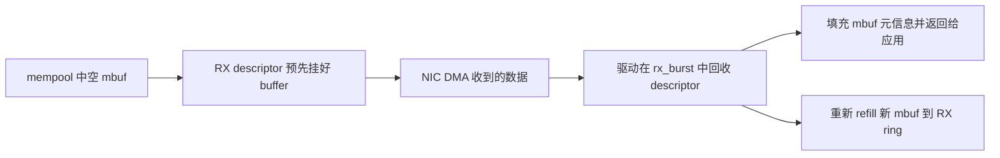

# RX/TX 数据通路

这一章是 DPDK 真正的热路径。前面的 EAL、mempool、mbuf、ethdev，如果说是在铺地基，那 `rte_eth_rx_burst()` / `rte_eth_tx_burst()` 就是应用每秒会调用几百万甚至几千万次的那两个门面函数。

这里最重要的不是 API 长什么样，而是 **包在 descriptor、mbuf、queue、NIC 之间到底怎么流动。**

---

## RX 路径

收包时，应用通常只看到：

```c
nb_rx = rte_eth_rx_burst(port_id, queue_id, pkts, burst);
```

但这背后至少有四步：

1. 驱动轮询 RX descriptor，看哪些槽位被硬件写完了
2. 取出这些 descriptor 关联的 mbuf
3. 把长度、checksum、RSS、VLAN、timestamp 等元信息写回 mbuf
4. 再从 mempool 补一批新 mbuf 给 RX ring



这也是为什么 RX 路径性能不仅取决于网卡和驱动，还非常依赖 mempool refill 的效率。

---

## TX 路径

发包看起来同样简单：

```c
nb_tx = rte_eth_tx_burst(port_id, queue_id, pkts, burst);
```

但 TX 路径做的事情不只是“告诉网卡去发”：

- 把 mbuf 转成硬件能理解的 TX descriptor
- 根据 `ol_flags` 和长度字段设置 offload 语义
- 把 descriptor 写入 TX ring
- 推进 doorbell/head-tail 寄存器
- 适当时机回收已发送完成的旧 mbuf

所以 TX burst 的返回值只是“成功放进队列的数量”，不是“包已经在线上飞走了的数量”。

---

## descriptor 是数据面真正的边界

应用看的是 mbuf，NIC 看的是 descriptor。驱动的核心职责，就是在这两者之间做极薄但极高频的翻译层。

- RX：从“硬件写好的 descriptor”翻成“应用可用的 mbuf”
- TX：从“应用提交的 mbuf”翻成“硬件可执行的 descriptor”

所以驱动性能优化的大头，通常就在：

- descriptor 布局
- ring 访问模式
- 缓存预取
- 向量化 burst 实现

---

## burst 为什么是默认 API

官方 PMD 文档很强调 burst-oriented 设计，这不是风格问题，而是吞吐问题。

burst 的好处至少有三点：

1. 均摊函数调用和同步成本
2. 让 CPU 更容易预取连续 descriptor / mbuf 指针
3. 更容易匹配硬件按 ring 批量推进的工作方式

所以在 DPDK 里，逐包处理常常只是逻辑语义，真正底层执行几乎都会尽量批量化。

---

## RX 热路径里的 refill 成本

很多人盯着收包逻辑分析半天，却忽略了一个事实：**RX 不只是取包，还要补空 buffer。**

如果 refill 不及时，RX ring 会因为空槽不够而掉包；如果 refill 很贵，RX 热路径就会被拖慢。

这也是为什么：

- `mempool` 本地 cache 很重要
- 驱动喜欢批量申请 mbuf
- pool 的 NUMA 位置会直接影响 RX 吞吐

---

## TX 回收为什么常常延迟

TX 路径里，mbuf 回收通常不会按包即时完成，而是和硬件写回状态、阈值参数绑在一起，比如：

- `tx_free_thresh`
- `tx_rs_thresh`

官方文档讲得很清楚：这样做是为了减少频繁检查 descriptor completion 的成本，以及减少不必要的 PCIe 写回流量。

从性能角度看，这是正确取舍；从使用角度看，这意味着你必须关注 TX queue 上“挂着多少尚未回收的 mbuf”。

---

## offload 是通过 mbuf 把意图带进 TX 的

应用调用 `tx_burst()` 前，真正告诉驱动“这包要不要做 checksum/TSO/tunnel offload”的，不是额外参数，而是 mbuf 里的元信息：

- `ol_flags`
- `l2_len`
- `l3_len`
- `l4_len`
- `outer_l2_len`
- `outer_l3_len`

所以 TX 快路径很大一部分成本，在于把这组软件语义编码成硬件 descriptor。

如果这些字段没填对，最常见的后果不是立刻报错，而是包悄悄被发坏。

---

## 向量化与批量查收发

很多 PMD 会有 scalar 路径和 vector 路径。后者通常要求更严格的前提：

- ring 大小、对齐满足要求
- descriptor 布局适合 SIMD 扫描
- burst 数量达到一定阈值
- 某些 offload 组合不能太复杂

这说明“开了 DPDK 就自动极致性能”并不成立。很多驱动只有在配置条件满足时，才会走真正的高性能收发实现。

---

## run-to-completion 与 pipeline

官方 PMD 文档一直围绕两种模型组织：

- run-to-completion
- pipeline

前者是一个核收、处理、发，结构简单、cache 局部性好；后者把收和处理分开，通过 ring 传递，更灵活，但引入额外排队成本。

所以 RX/TX 数据通路分析不能脱离调度模型。你观察到的延迟、cache miss、burst 大小、回压行为，都会和这层拓扑强相关。

---

## 常见坑

### 1. 只盯 `rx_burst()` 返回值，不看 refill 和 dropped stats

收包量低未必是没包，也可能是 RX ring 补货跟不上。

### 2. 只看 `tx_burst()` 返回成功，就假设 mbuf 马上回收

这会导致对象池容量估算完全偏小。

### 3. 用过小的 burst

热路径成本很难摊薄，向量化也可能起不来。

### 4. queue 与 lcore 绑定混乱

多核共享 RX/TX queue，通常直接把数据面优势打掉一大半。

---

## 一个更贴近真实机器的理解

RX/TX 数据通路其实就是三类环在协作：

- NIC 自己的 descriptor ring
- 软件里的 mempool / mbuf 生命周期
- 应用侧 burst 处理循环

真正高性能时，这三者的节奏应该是对齐的：descriptor 批量完成、软件批量搬运、应用批量处理。任何一个环节粒度错了，性能就会掉得很明显。
