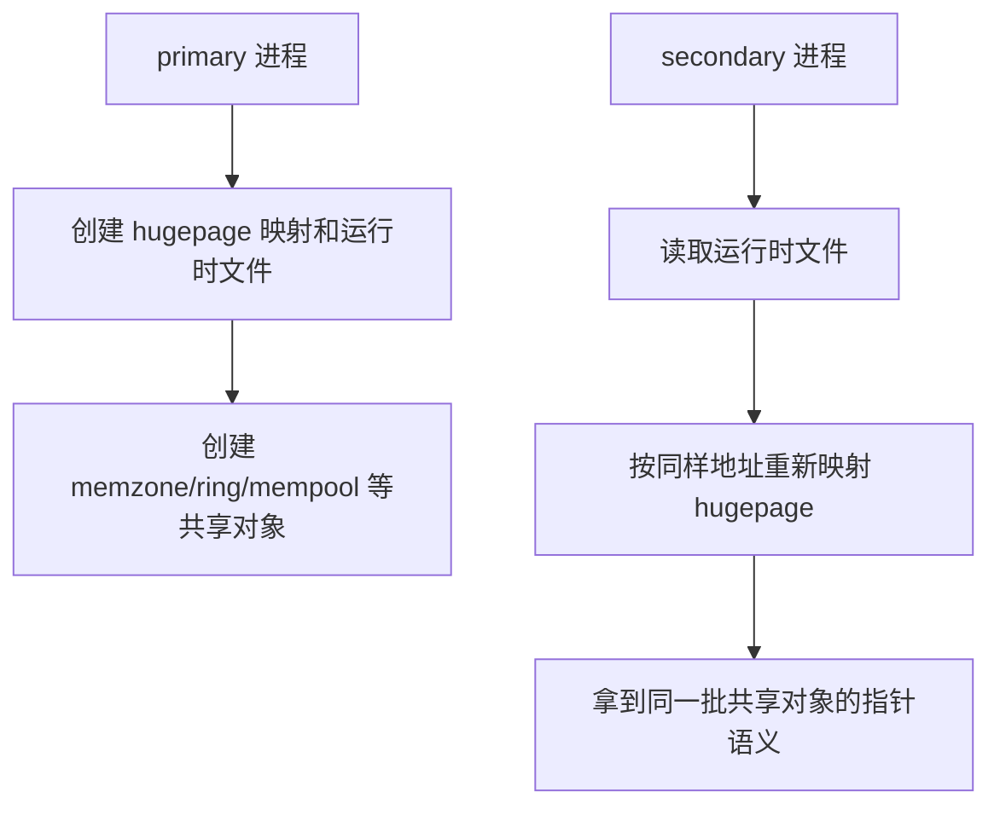

# multi-process 与 IPC

DPDK 除了多线程，还支持多进程协作。这一点刚接触时会觉得有点反直觉，因为大家已经习惯“高速数据面 = 一个进程里绑很多核”。但 DPDK 的多进程支持其实很实用，尤其适合做角色隔离、主从结构或者多个进程共享同一套 hugepage 对象。

核心前提只有一个：**所有进程必须看到同一套共享内存布局。**

---

## primary 与 secondary

DPDK 多进程里最基本的身份分工是：

- primary：初始化共享内存和全局运行时
- secondary：附着到既有共享内存，复用里面的对象

这不是“主进程更重要”这么简单，而是职责边界不同。secondary 不是把 primary 里的对象拷一份，而是把同一批 hugepage 重新映射到自己进程里。

---

## 为什么 `--file-prefix` 这么重要

EAL 会在运行时目录里生成一批共享文件，比如配置和 hugepage backing file 的命名空间。

`--file-prefix` 决定的是：**你到底想和谁共享这一套运行时。**

- 相同 `file-prefix`：默认就是同一个共享世界
- 不同 `file-prefix`：彼此隔离，适合并排运行独立实例

所以多进程里，`file-prefix` 不是可有可无的命名选项，而是隔离边界本身。

---

## memory sharing 怎么成立

官方文档说得很直白：primary 启动时会把 hugepage 使用情况、映射地址、内存布局等信息记录下来；secondary 启动时读这些信息，再复现同样的映射。

这就解释了为什么 multi-process 对地址空间一致性如此敏感。因为共享对象里的指针值本身是直接用的，如果不同进程把同一块 hugepage 映射到不同虚拟地址，很多指针就不再有意义。

这也是 ASLR 会给 secondary 带来麻烦的根本原因。

---

## multi-process 适合什么模型

官方文档给了两种典型部署：

### peer / symmetric

多个进程做同样的工作，类似多线程版 “每个 worker 跑同一段 main loop”。

### asymmetric / client-server

一个 primary 负责收包、调度、分发，多个 secondary 负责处理。进程之间通常靠共享 ring 传递 mbuf 指针。

第二种在工程里更常见，因为职责清晰，也更容易把控制逻辑和处理逻辑拆开。

---

## IPC API 解决什么问题

共享内存只能解决“大家都能看到同一批对象”，但不天然解决“我想通知另一个进程做点事”。为此 DPDK 提供了原生 IPC API。

它的定位不是超高性能消息总线，而是一个方便的短消息机制。

支持的基本模式是：

- secondary -> primary 单播
- primary -> 所有 secondary 广播

这点非常重要：它不是任意点对点消息系统，所以设计应用协议时要顺着这个拓扑来想。

---

## 三种通信语义

IPC API 大致有三类：

- message：通知，不等回包
- synchronous request：同步请求，等回复
- asynchronous request：异步请求，稍后回调

对应接口里，消息体通常是 `rte_mp_msg`，里面包含：

- `name`
- `param`
- `len_param`
- `fds`
- `num_fds`

可以看出来，这套设计更偏“控制消息 + 少量附带参数”，而不是拿来搬大数据。

---

## callback 跑在哪个线程里

这是很容易被忽略的一点。官方文档明确说过，IPC 的回调是在专门的 IPC 或 interrupt 线程里触发的，不属于普通 EAL lcore worker。

这带来两个现实后果：

- 回调里不要写成像数据面 worker 那样的逻辑
- 不要在里面做容易重入出问题的操作，尤其是和内存回调、alarm、interrupt 混用时

这也是为什么官方对异步请求超时的警告写得比较重，因为那时 callback 可能跑在 interrupt thread 里。

---

## multi-process 的硬限制

官方文档里列了几个很现实的限制，值得直接记住：

1. secondary 必须和 primary 用相同 DPDK 版本
2. 共享进程之间 lcore 不能重叠
3. secondary 拿不到设备中断
4. 不同二进制之间共享函数指针语义不可靠
5. ASLR 可能让地址映射失败

第 4 点尤其坑，因为像 hash 这类内部用函数指针的库，在多进程里如果二进制布局不一致，就会出很奇怪的问题。

---

## 独立实例并排运行

DPDK 不只是支持“一组合作进程”，也支持“多个互不相关的 DPDK 程序并排跑”。这时关键就是：

- 不同 `--file-prefix`
- 明确限制各自 hugepage 使用量
- 不共享同一块端口

这说明 DPDK 多进程的本质，不是某种固定部署模式，而是“对 hugepage 运行时命名空间的可控复用”。

---

## 常见坑

### 1. secondary 参数没和 primary 对齐

特别是 `--legacy-mem`、`--single-file-segments`、allow/block 之类，一不一致就容易出内存损坏或 attach 失败。

### 2. 进程间 lcore 重叠

这会连 mempool cache 都搞坏，不是小问题。

### 3. 把 IPC 当高频数据通道

IPC 适合控制消息，不适合搬数据面 payload。

### 4. 以为 secondary 能像 primary 一样处理设备事件

中断只在 primary 里触发，这是硬边界。

---

## 一个最实用的理解

DPDK multi-process 的核心不是“多开几个进程”，而是：

- 用同一套 hugepage 版图共享对象
- 用 primary/secondary 角色管理初始化权力
- 用 IPC 做轻量控制协作

只要把这三点抓住，再看 sample 应用或自己设计主从进程模型时，很多限制都会显得很自然。
