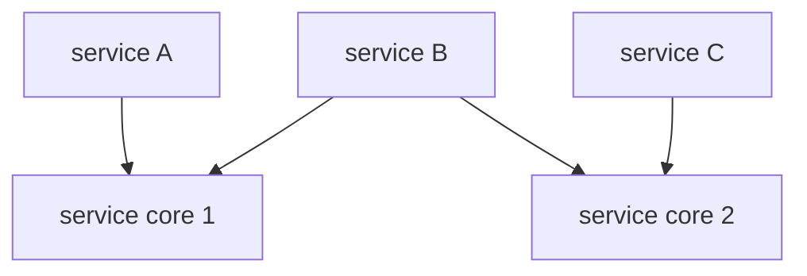

# service cores 与调度

DPDK 大多数人熟悉的是 worker lcore：一个核跑一个循环，自己收包、处理、发包。但官方后来引入了 `service core` 概念，用来处理另一类工作：**这些工作也需要 CPU 周期，但不适合硬绑到某个业务主循环里。**

这层设计很适合做软件调度器、后台维护任务、某些软 PMD 的运行时服务。

---

## 什么是 service

官方定义里，service 是“需要 CPU 周期的组件”；service core 则是专门负责跑这些 service 的 lcore。

这个定义看着抽象，其实很好理解。比如：

- 某个 eventdev 软件 PMD 需要软件调度
- 某个后台任务需要周期性运行
- 某个组件想把维护逻辑从主 worker 循环拆出来

这些事情都不是传统的“收一批包处理一批包”，但又确实要吃 CPU。service core 就是给它们准备的执行位。

---

## 为什么不直接开个 pthread

因为如果每个库都自己开线程，最后应用很难统一管理：

- 哪些核专门给后台服务
- 哪些核只跑数据面
- 哪些服务可以迁移、关闭、重新绑定

DPDK 把 service core 放进 EAL 体系后，应用可以用统一接口管理这类“非主循环但仍属于 DPDK 运行时”的工作。

从这个角度看，service core 更像“受 EAL 管理的后台执行框架”。

---

## 初始化方式

官方文档提到两种方式：

- 启动时通过 `-S` 指定 service core 列表
- 运行时通过 API 动态把某些 lcore 设成 service core

这说明 service core 不是一种独立线程类型，而是 EAL lcore 的一种角色。

也就是说，一个核先得在 `-l` 的可用集合里，然后才可能再被声明为 service core。

---

## service 与 core 的映射

service core 机制的真正价值，不在于“多了一类线程”，而在于它把下面这层映射做成了显式配置：

- 哪个 service 在哪些 core 上允许运行
- 一个 core 跑几个 service
- 某个 service 是不是可以多 core 并行

官方文档里描述得很朴素：每个 service core 会遍历本 core 上启用的 services，依次调用它们的 run 函数。

这意味着 service core 更像 cooperative loop，而不是抢占式调度器。

---

## 什么场景适合 service core

我觉得最适合的有三类：

### 1. 软件设备/软件调度逻辑

比如 eventdev 的软件 PMD。硬件型 eventdev 不需要这套，但软件型需要 CPU 去跑调度器。

### 2. 周期性后台任务

例如维护表项、采样、清理队列、异步状态推进。

### 3. 想和数据面主循环解耦的控制性工作

有些工作放在 worker loop 里会扰动包处理节奏，拆到 service core 更清晰。

---

## 什么场景不适合

如果某项工作：

- 明显是纯控制面、低频、和 DPDK 栈关系不大
- 或者需要复杂阻塞 I/O
- 或者更适合普通线程池

那没必要强行塞进 service core。因为 service core 的优势，主要在于它和 EAL/lcore 体系天然对齐，而不是通用线程管理能力更强。

---

## 统计与 tracing

官方文档提到 service core 自带运行时统计：

- 调用了多少次
- 用了多少 CPU cycles

这很有价值，因为 service core 最容易出现的问题就是“后台工作悄悄吞了多少 CPU，你自己还没意识到”。

新版文档还提到可通过 Trace Library 打开 `lib.eal.service*` 相关 tracepoint，这对观察 service 启停、调度状态变化特别有帮助。

---

## service core 和 worker 的边界

一个很实用的区分标准是：

- worker：吞吐导向，主路径尽量稳定，通常和队列绑定
- service core：辅助导向，承担背景运行和共享服务

如果把两者搅在一起，经常会出现“后台任务偶尔抖一下，把包处理时延也带抖”的情况。

所以 service core 不是为了替代 worker，而是为了让 worker 更纯粹。

---

## 常见坑

### 1. service core 和业务 worker 抢同一批 CPU

这样会让后台任务直接污染数据面核的稳定性。

### 2. 一个 core 挂太多 services

cooperative loop 下，很容易互相拖慢。

### 3. 以为 service core 是自动负载均衡的

它更多提供“映射和运行框架”，负载怎么分仍然要应用自己设计。

---

## 一个更贴近工程的理解

可以把 service core 看成 DPDK 给“后台但仍与数据面强相关”的任务准备的一块专用跑道。

它最大的意义不是把线程开出来，而是把：

- CPU 归属
- 生命周期
- 统计
- 和 EAL 的一致性

这些事情统一起来。对于复杂一点的应用，这种角色分层其实很有价值。
