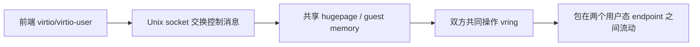

# vhost-user / virtio-user

`vhost-user` 和 `virtio-user` 这组东西特别容易在脑子里缠住，因为它们同时涉及：

- 虚拟设备协议
- 共享内存
- Unix domain socket
- vring
- 容器/VM 场景

但如果抓住一句话，其实不难：**它们都是为了让用户态程序直接和 virtio ring 对接，把包在两个用户态 endpoint 之间高效搬运。**

---

## vhost 库解决什么问题

官方文档说得很直白：vhost library 实现了一个用户态 virtio net server，让应用能直接操作 virtio ring。

也就是说，对 DPDK 应用而言，它不再只是一个普通网卡驱动，而是成了“virtio 后端”：

- 从 guest/peer 的 virtio ring 取包
- 把包放回 guest/peer 的 virtio ring

要做到这一点，vhost 至少要知道两类信息：

- guest memory 在哪里
- vring 的 layout 和通知机制是什么

这也是为什么 vhost-user 协议要通过 Unix socket 传一堆控制消息和文件描述符。

---

## 为什么需要共享内存

virtio 本质上是基于共享内存的 ring 协议。无论在 VM 还是容器里，想做到高性能，最终都得让前后端能看到同一片数据缓冲区。

在 VM 里，QEMU 可以把 guest RAM 的信息分享给 vhost backend；在容器或纯进程场景里，`virtio-user` 则只共享 DPDK 自己初始化出来的 hugepage 区域。

所以这条链路的关键一直是：

---

## vhost-user 的两种角色

DPDK vhost-user 可以：

- 当 server
- 当 client

默认更常见的是 server：DPDK 创建 Unix socket，等前端来连。

但在某些部署里，DPDK 当 client 更方便，因为它能不断尝试重连，适合 QEMU 或其他前端重启的场景。官方文档里甚至把 reconnect 行为单独列成能力开关。

---

## vhost 库提供的核心接口

几个最常见的 API 基本把生命周期串起来了：

- `rte_vhost_driver_register()`
- `rte_vhost_driver_callback_register()`
- `rte_vhost_driver_start()`
- `rte_vhost_enqueue_burst()`
- `rte_vhost_dequeue_burst()`

前三个负责把后端建起来，后两个负责真正收发包。

从应用视角看，它就像一个特殊的“软件网卡端口”，只不过底层不是 PCI NIC，而是 virtio ring。

---

## virtio-user 是什么

`virtio-user` 可以理解成“把 virtio 前端做成 DPDK 里的一个虚拟设备”，这样容器里的 DPDK 进程或本机进程就能像使用普通 DPDK port 一样使用它。

官方 HowTo 给的场景很典型：

- 宿主机 testpmd 起一个 `eth_vhost0`
- 容器里的 testpmd 起一个 `virtio_user0`
- 双方通过共享 hugepage 文件和 socket 对接

这样本质上就把“VM 里的 virtio/vhost 思路”平移到了容器/进程通信里。

---

## 为什么这套方案适合容器网络/IPC

因为它不需要真的引入 PCI 虚拟设备，也不需要完整 QEMU 设备模拟层，而是直接把：

- DPDK 的 hugepage 共享能力
- virtio 的 ring 协议
- Unix socket 的控制通道

组合起来。

所以官方 HowTo 里明确说，`virtio-user` 既能做高性能容器网络，也能做进程间通信。

---

## 限制为什么都和内存映射有关

HowTo 文档列的几个限制，几乎全都和共享内存 reopening / 文件句柄有关：

- 不能和 `--huge-unlink` 一起用
- 不能和 `--no-huge` 一起用
- hugepage region 太多会有上限问题
- `--single-file-segments` 有时能缓解 region 数量问题

这些限制说明一件事：**这条链路的真正底座不是 socket，而是可重新打开、可共享的 hugepage backing file。**

socket 只负责传控制面消息，数据面真正搬运还是靠共享内存。

---

## 异步 datapath 与 DMA 加速

新版 vhost 文档还提到了 async data path。这个思路很自然：如果数据搬运主要是 memory copy，那就有机会把它交给 DMA 之类的异步引擎，减轻 CPU 压力。

对应用来说，这就意味着 vhost 已经不只是“一个用户态协议后端”，而是在继续往更像专业 datapath 组件的方向演化。

---

## vhost 与普通 ethdev 的差别

表面上两者最后都能表现成 port，应用也可能都是调 burst API，但本质区别很大：

- 普通 PMD 面向 NIC descriptor ring
- vhost/virtio-user 面向 virtio vring 和共享内存协议

所以分析性能问题时，不能把它们混着看。vhost-user 更容易受到：

- 内存 region 数量
- socket 连接状态
- 前后端特性协商
- copy / zero-copy / async copy 模式

的影响。

---

## 常见坑

### 1. 以为 socket 是性能瓶颈主路径

socket 更多是控制面。真正数据面瓶颈通常还是共享内存访问和 copy 路径。

### 2. hugepage 配置不对

比如用了 `--no-huge` 或 `--huge-unlink`，这套方案就直接站不住了。

### 3. 忽略前后端 feature 必须一致

特别是重连或重启场景，feature 变了很容易出现很怪的问题。

### 4. 把容器里的 virtio-user 当成普通软件 loopback

它其实仍然遵守 virtio/vhost 的共享内存和协商语义，不是简单 IPC socket。

---

## 一个更工程化的理解

可以把这组机制拆成两半看：

- `vhost-user`：后端，负责看懂 virtio ring 并收发包
- `virtio-user`：前端，把 virtio 设备做成 DPDK 可用的虚拟 port

两边靠共享 hugepage 和 socket 上的控制消息握手。这样一来，容器、进程甚至某些异常路径场景，都能复用同一套高性能传输思路。
