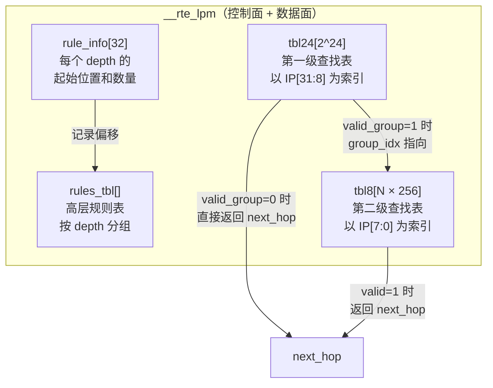
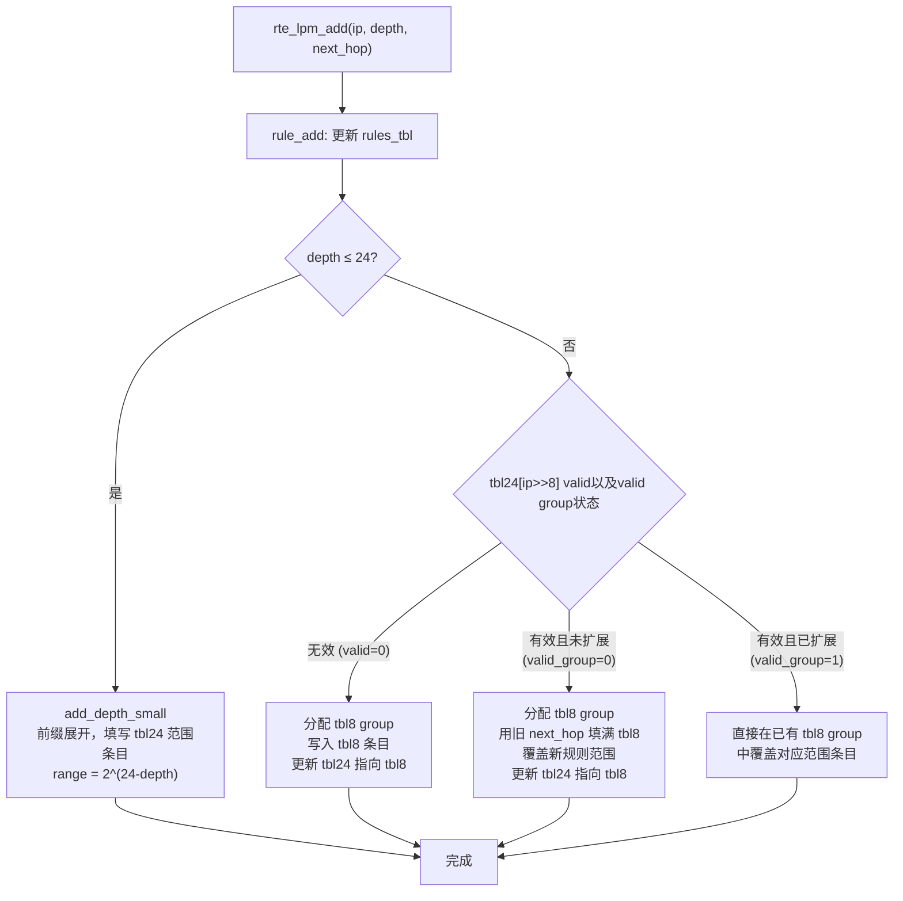
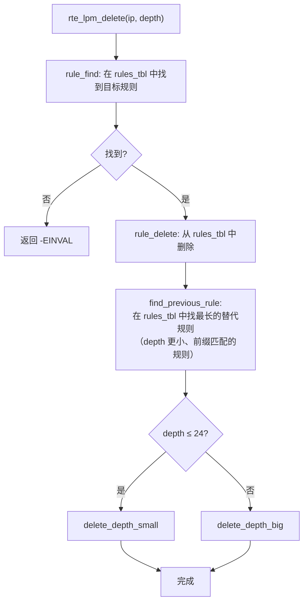
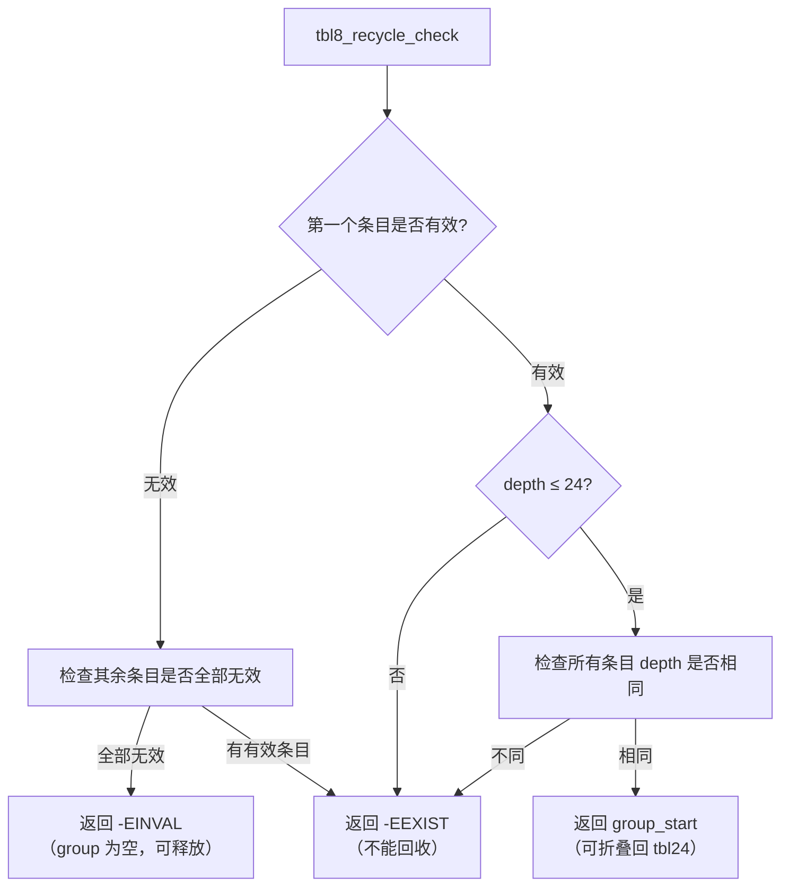
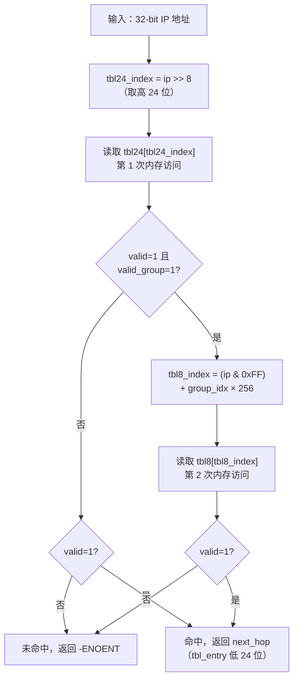

# lpm算法

网上对于 DPDK LPM 算法的描述都有点不清不楚的，还不如官方的描述。

我这里就结合官方的 [文档](./https://doc.dpdk.org/guides/prog_guide/lpm_lib.html#lpm4-details)，然后结合我自己的理解把优劣都说一下。


---

## 原理

LPM（Longest Prefix Match，最长前缀匹配）是 IP 路由转发中的核心算法。对于一个目的 IP 地址，需要在路由表中找到与之匹配的、前缀最长的那条路由规则，并返回其 next hop。

DPDK 的 LPM 实现采用了 **DIR-24-8** 算法的变体，核心思路是：**用空间换时间**，通过预展开（prefix expansion）将查找操作压缩到 1~2 次内存访问。

---

### 基本数据结构

整个 LPM 实例由三层数据结构组成：

```
┌─────────────────────────────────────────────────────────────────┐
│                        struct __rte_lpm                         │
│                                                                 │
│  ┌──────────────────────────────────────────────────────────┐   │
│  │                    struct rte_lpm                        │   │
│  │  tbl24[2^24]  ──────────────────────────────────────►   │   │
│  │  *tbl8        ──────────────────────────────────────►   │   │
│  └──────────────────────────────────────────────────────────┘   │
│                                                                 │
│  name[32]                                                       │
│  max_rules                                                      │
│  number_tbl8s                                                   │
│  rule_info[32]  (每个 depth 一个 rte_lpm_rule_info)             │
│  *rules_tbl     (高层规则表，用于增删查)                         │
│  *v / rcu_mode / *dq  (RCU 相关)                                │
└─────────────────────────────────────────────────────────────────┘
```

#### 1. tbl24 —— 第一级查找表

```c
// rte_lpm.h
#define RTE_LPM_TBL24_NUM_ENTRIES  (1 << 24)   // 16,777,216 个条目

struct rte_lpm_tbl_entry {
    uint32_t next_hop    :24;  // next hop 或 tbl8 的 group 索引
    uint32_t valid       :1;   // 该条目是否有效
    uint32_t valid_group :1;   // 0: 直接存 next_hop; 1: 指向 tbl8
    uint32_t depth       :6;   // 匹配的规则深度（前缀长度）
};
```

每个条目 **4 字节**，整张表共 **64 MB**。以 IP 地址的高 24 位作为索引。

`valid_group` 字段是关键标志：
- `valid_group == 0`：该条目直接存储 next hop，查找在此结束
- `valid_group == 1`：该条目存储的是 tbl8 的 group 索引，需要继续查 tbl8

#### 2. tbl8 —— 第二级查找表

```c
// rte_lpm.h
#define RTE_LPM_TBL8_GROUP_NUM_ENTRIES  256        // 每个 group 256 个条目
#define RTE_LPM_TBL8_NUM_GROUPS         256        // 默认 256 个 group（可配置）
```

tbl8 由若干个 **group** 组成，每个 group 有 256 个 `rte_lpm_tbl_entry`，以 IP 地址的低 8 位作为索引。

对于 tbl8 中的条目，`valid_group` 字段含义变为：**当前 tbl8 group 是否正在使用**（而非指向下一级）。

#### 3. rules_tbl —— 高层规则表

```c
// rte_lpm.c (内部结构)
struct rte_lpm_rule {
    uint32_t ip;        // 规则的 IP 地址（已按 depth 做掩码）
    uint32_t next_hop;  // 下一跳
};

struct rte_lpm_rule_info {
    uint32_t used_rules;  // 该 depth 已使用的规则数
    uint32_t first_rule;  // 该 depth 规则在 rules_tbl 中的起始索引
};
```

`rules_tbl` 是一个平坦数组，按 depth 分组存储所有规则。`rule_info[32]` 数组记录每个 depth（1~32）的规则起始位置和数量。

这张表**不参与数据面查找**，仅用于控制面的增删操作（检查规则是否存在、删除时寻找替代规则等）。

#### 整体结构关系图



#### tbl_entry 字段布局（小端）

```
 31      8  7     6  5      1   0
┌──────────┬───────┬──────────┬───────┐
│ next_hop │ depth │valid_grp │ valid │
│  [23:0]  │ [5:0] │   [1]    │  [0]  │
└──────────┴───────┴──────────┴───────┘
```

> **优点**：整个条目只有 4 字节，一次内存读取即可获取所有信息，对 CPU cache 非常友好。

---

### Add Rules（添加规则）

添加一条规则 `(ip, depth, next_hop)` 分为两个阶段：

**阶段一：更新 rules_tbl（控制面）**

**阶段二：更新 tbl24/tbl8（数据面）**

#### 阶段一：rule_add

```c
// rte_lpm.c
static int32_t
rule_add(struct __rte_lpm *i_lpm, uint32_t ip_masked, uint8_t depth,
         uint32_t next_hop)
```

`rules_tbl` 按 depth 分组，各组在数组中**紧密排列**。添加新规则时，需要将更高 depth 的规则整体后移一位，为新规则腾出空间：

```
添加前（depth=20 的规则组后面紧跟 depth=25 的规则组）：
┌────────────────┬────────────────┬────────────────┐
│  depth=20 组   │  depth=25 组   │   (空闲)        │
└────────────────┴────────────────┴────────────────┘

添加 depth=20 的新规则后：
┌─────────────────┬────────────────┬────────────────┐
│  depth=20 组+1  │  depth=25 组   │   (空闲)        │
└─────────────────┴────────────────┴────────────────┘
（depth=25 组的 first_rule 指针 +1，整体后移）
```

若规则已存在（相同 ip_masked + depth），且nexthop相同，返回 `-EEXIST`，**不需要更新数据面**。
如果next_hop 不相同， 则更新 next_hop，需要更新数据面。

#### 阶段二：更新数据面

根据 depth 的大小，走不同的路径：

```c
// rte_lpm.c: rte_lpm_add
if (depth <= MAX_DEPTH_TBL24) {       // depth ∈ [1, 24]
    status = add_depth_small(...);
} else {                               // depth ∈ [25, 32]
    status = add_depth_big(...);
}
```

##### add_depth_small（depth ≤ 24）

核心是**前缀展开（Prefix Expansion）**：

一条 depth=20 的规则，意味着有 `2^(24-20) = 16` 个 tbl24 索引都能匹配到它，因此需要将这 16 个 tbl24 条目全部填写。

```c
// rte_lpm.c: add_depth_small
tbl24_index = ip >> 8;
tbl24_range = depth_to_range(depth);   // = 1 << (24 - depth)

for (i = tbl24_index; i < (tbl24_index + tbl24_range); i++) {
    // 只覆盖无效条目，或 depth 更浅（优先级更低）的条目
    if (!tbl24[i].valid || (tbl24[i].valid_group == 0 &&
            tbl24[i].depth <= depth)) {
        // 直接写入 next_hop，valid_group = 0
        __atomic_store(&tbl24[i], &new_tbl24_entry, __ATOMIC_RELEASE);
    }
    // 若该 tbl24 条目已经扩展到 tbl8，则同步更新 tbl8 中 depth 更浅的条目
    if (tbl24[i].valid_group == 1) {
        // 遍历整个 tbl8 group，更新 depth <= 当前 depth 的条目
        for (j = tbl8_index; j < tbl8_group_end; j++) {
            if (!tbl8[j].valid || tbl8[j].depth <= depth)
                __atomic_store(&tbl8[j], &new_tbl8_entry, __ATOMIC_RELAXED);
        }
    }
}
```

```
示例：添加规则 10.0.0.0/20（depth=20）

IP 高 24 位范围：0x0A0000 ~ 0x0A000F（共 16 个）

tbl24:
index: 0x0A0000  0x0A0001  ...  0x0A000F
       [nh=X,d=20] [nh=X,d=20] ... [nh=X,d=20]
       valid_group=0（直接命中，无需查 tbl8）
```

##### add_depth_big（depth > 24）

depth > 24 时，tbl24 只有**一个**条目对应该规则（高 24 位唯一确定），需要借助 tbl8 存储低 8 位的区分信息。

分三种情况：

**情况 1：tbl24 条目无效（全新）**

```
1. 分配一个空闲的 tbl8 group: 注意，分配逻辑只看 tbl8 group 第一个的entry 的valid_group 是否为1 
2. 在 tbl8 group 中，将 [ip & 0xFF, ip & 0xFF + range) 范围的条目写入 next_hop
3. 将 tbl24 条目更新为：valid=1, valid_group=1, group_idx=<tbl8 group 索引>
   （先写 tbl8，再写 tbl24，保证原子性）
```

**情况 2：tbl24 条目有效但未扩展（valid_group=0，已有 depth≤24 的规则）**

```
1. 分配一个空闲的 tbl8 group
2. 用 tbl24 中已有的 next_hop 填满整个 tbl8 group（继承旧规则）: 为什么？ 因为depth<= 24 的entry 很显然可以匹配上当前 tbl8 中的所有项目。
3. 再将 [ip & 0xFF, ip & 0xFF + range) 范围的条目覆盖为新 next_hop: 因为这个 range 的数据都可以匹配上这个ip，并且原先的 depth <= 24 的数据优先级没有这个entry 高
4. 将 tbl24 条目更新为指向新 tbl8 group =》 nexthop 指向 tbl8_group_index， valid group 为 1
```

**情况 3：tbl24 条目已扩展（valid_group=1，已有 tbl8）**

```
1. 直接找到对应的 tbl8 group =》 通过 tbl24 的 nexthop
2. 在 tbl8 group 中，将 [ip & 0xFF, ip & 0xFF + range) 范围内
   depth 更浅的条目覆盖为新 next_hop
```



> **关键设计**：写 tbl8 和写 tbl24 的顺序很重要。代码中先用 `__ATOMIC_RELAXED` 写 tbl8，再用 `__ATOMIC_RELEASE` 写 tbl24，确保读者看到 tbl24 的新值时，tbl8 的数据已经就绪，避免读到脏数据。

---

### Del Rules（删除规则）

删除比添加复杂，因为删除一条规则后，原来被它覆盖的"更短前缀规则"需要被**恢复**出来。

#### 整体流程

```c
// rte_lpm.c: rte_lpm_delete
int rte_lpm_delete(struct rte_lpm *lpm, uint32_t ip, uint8_t depth)
```



#### find_previous_rule —— 寻找替代规则

```c
// rte_lpm.c
static int32_t
find_previous_rule(struct __rte_lpm *i_lpm, uint32_t ip, uint8_t depth,
                   uint8_t *sub_rule_depth)
{
    // 从 depth-1 向下逐一查找，找到第一个匹配的规则
    for (prev_depth = depth - 1; prev_depth > 0; prev_depth--) {
        ip_masked = ip & depth_to_mask(prev_depth);
        rule_index = rule_find(i_lpm, ip_masked, prev_depth);
        if (rule_index >= 0) {
            *sub_rule_depth = prev_depth;
            return rule_index;
        }
    }
    return -1;  // 没有替代规则
}
```

例如：删除 `10.0.0.0/24`，若存在 `10.0.0.0/16`，则后者就是替代规则，删除后 tbl24 中对应条目应恢复为 `/16` 的 next_hop。

#### delete_depth_small（depth ≤ 24）

遍历 tbl24 中该规则覆盖的所有条目（range = `2^(24-depth)` 个）：

- **无替代规则**：将 depth ≤ 被删规则 depth 的条目置为无效（`valid = 0`）
- **有替代规则**：将 depth ≤ 被删规则 depth 的条目更新为替代规则的 next_hop 和 depth

对于已扩展到 tbl8 的条目，同样需要遍历整个 tbl8 group 做相同处理。

#### delete_depth_big（depth > 24）

只涉及一个 tbl24 条目和对应的 tbl8 group：

1. 在 tbl8 group 中，将 depth ≤ 被删规则 depth 的条目置无效或更新为替代规则
2. 检查 tbl8 group 是否可以回收（`tbl8_recycle_check`）：

```c
// tbl8 回收判断逻辑（tbl8_recycle_check）：
// 返回 -EINVAL：整个 group 全部无效 → 可以直接释放，tbl24 条目也置无效
// 返回 >= 0   ：整个 group 的值完全相同且 depth ≤ 24 → 可以"折叠"回 tbl24
// 返回 -EEXIST：group 中还有不同的有效条目 → 不能回收
```



**tbl8 回收的两种结果**：

- **全空**：先将 tbl24 条目的 `valid` 置 0，再通过 `tbl8_free` 释放 tbl8 group
- **可折叠**：将 tbl8 group 中的值"提升"回 tbl24（`valid_group` 从 1 改为 0），再释放 tbl8 group

> **RCU 安全**：`tbl8_free` 在有 RCU 时不会立即清零 tbl8，而是等待所有读者离开临界区（SYNC 模式）或将其加入延迟队列（DQ 模式），避免读者访问到已被清零的 tbl8 group。

---

### Lookup Rules（查找规则）

查找是**数据面热路径**，实现为内联函数，极度优化：

```c
// rte_lpm.h
static inline int
rte_lpm_lookup(struct rte_lpm *lpm, uint32_t ip, uint32_t *next_hop)
{
    unsigned tbl24_index = (ip >> 8);       // 取高 24 位作为 tbl24 索引
    uint32_t tbl_entry;
    const uint32_t *ptbl;

    // 第一次内存访问：读 tbl24
    ptbl = (const uint32_t *)(&lpm->tbl24[tbl24_index]);
    tbl_entry = *ptbl;

    // 判断是否需要查 tbl8（valid=1 且 valid_group=1）
    if (unlikely((tbl_entry & RTE_LPM_VALID_EXT_ENTRY_BITMASK) ==
                  RTE_LPM_VALID_EXT_ENTRY_BITMASK)) {

        // 第二次内存访问：读 tbl8
        unsigned tbl8_index = (uint8_t)ip +           // 低 8 位
                ((tbl_entry & 0x00FFFFFF) *            // group_idx
                 RTE_LPM_TBL8_GROUP_NUM_ENTRIES);      // × 256

        ptbl = (const uint32_t *)&lpm->tbl8[tbl8_index];
        tbl_entry = *ptbl;
    }

    *next_hop = (tbl_entry & 0x00FFFFFF);   // 取低 24 位为 next_hop
    return (tbl_entry & RTE_LPM_LOOKUP_SUCCESS) ? 0 : -ENOENT;
}
```

查找流程：



#### 性能关键点

| 特性 | 说明 |
|------|------|
| **1~2 次内存访问** | 绝大多数路由（depth ≤ 24）只需 1 次 tbl24 访问 |
| **无锁读** | 查找路径完全无锁，依赖数据流依赖保证顺序，无需内存屏障 |
| **SIMD 批量查找** | `rte_lpm_lookupx4` 利用 SSE/NEON 一次查找 4 个 IP |
| **Cache 友好** | tbl24 条目 4 字节，64 字节 cache line 可容纳 16 个条目 |

#### 批量查找（rte_lpm_lookup_bulk）

```c
// 两阶段批量查找，充分利用内存级并行（MLP）
// 阶段 1：批量计算所有 tbl24 索引
for (i = 0; i < n; i++)
    tbl24_indexes[i] = ips[i] >> 8;

// 阶段 2：批量读取 tbl24，按需读取 tbl8
for (i = 0; i < n; i++) {
    next_hops[i] = tbl24[tbl24_indexes[i]];
    if (需要查 tbl8)
        next_hops[i] = tbl8[...];
}
```

两阶段设计让 CPU 可以**预取**后续的 tbl24 条目，隐藏内存延迟，在大批量查找时性能显著优于逐条查找。

---

## 优势

1. 对于 24bit 以下的掩码，查找复杂度基本可以认为是o(1)的.
2. 用了一个大数组，内存访问会比较友好
3. rcu锁，读完全无锁 (普通的rwlock对cache很不友好，有很多文章都说了rwlock在一些场景下性能甚至不如mutex！)
4. 这个设计很符合硬件的设计逻辑，适合硬件卸载

## 劣势

1. 占用内存大，单个LPM表初始化之后占用就在 60M+
2. KEY 无法扩展，只支持了 IPV4/IPV6，ipv6的字节足够长，可能通过构造也勉强能用
3. nexthop 无法扩展，现在给的是portId， 实际使用的时候往往有更多的需求
4. lpm add/del 最差情况下是o(n)的，主要开销是在 rule 的管理: 实际使用中还好，因为很多sdn网络也不会有那么快的路由变配。