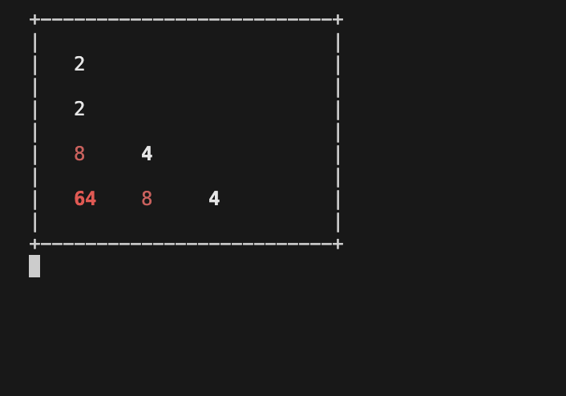

# vm_write_in_rust

写一个简单的VM，类似于JVM，使用 LC-3 架构，参考文档 <https://www.jmeiners.com/lc3-vm/>

## 项目地址

<https://github.com/fkcrazy001/lc3vm.git>
```sh
# to play 2048 game:
cargo run -- ./2048.obj
```



## LC-3 架构

当我们研究一个新的VM时，`内存模型，指令集` 这些指标是我们需要关注的。

- 内存: 地址范围 128K, 位宽 16bit
- Cpu
  - 寄存器: 8个16位的通用寄存器(R0-R7)，1个PC，一个FLAG寄存器
  - opCode:

    ```
    OP_BR = 0, /* branch */
    OP_ADD,    /* add  */
    OP_LD,     /* load */
    OP_ST,     /* store */
    OP_JSR,    /* jump register */
    OP_AND,    /* bitwise and */
    OP_LDR,    /* load register */
    OP_STR,    /* store register */
    OP_RTI,    /* unused */
    OP_NOT,    /* bitwise not */
    OP_LDI,    /* load indirect */
    OP_STI,    /* store indirect */
    OP_JMP,    /* jump */
    OP_RES,    /* reserved (unused) */
    OP_LEA,    /* load effective address */
    OP_TRAP    /* execute trap */
    ```

实现时，需要具体的查看[1], 详细的描述的操作码，地址空间，异常等。

## 定义Vm

现在，我们可以定义Vm了

```rust

pub trait AddessSpace: Send {
    fn write(&self, addr: u16, value: u16);
    fn read(&self, addr: u16) -> u16;
}

pub struct Vm<A: AddessSpace> {
    pub cpu: Cpu,
    pub addess_space: A,
}


use bitflags::bitflags;

bitflags! {
    pub struct Cond:u16 {
        const FL_POS = 1 << 0; /* P */
        const FL_ZRO = 1 << 1; /* Z */
        const FL_NEG = 1 << 2; /* N */
    }
}

pub struct Cpu {
    pub regs: [u16; 8],
    pub pc: u16,
    pub cond: Cond,
}
```

## 跑 hello world!

这是官方给出的汇编示例。

```asm
.ORIG x3000                        ; this is the address in memory where the program will be loaded
LEA R0, HELLO_STR                  ; load the address of the HELLO_STR string into R0
PUTs                               ; output the string pointed to by R0 to the console
HALT                               ; halt the program
HELLO_STR .STRINGZ "Hello World!"  ; store this string here in the program
.END                               ; mark the end of the file
```

假设已经有了汇编器，最终这些汇编汇编会被翻译成机器码。

现在需要实现一下机器码的解析。

### opcode 解析

按照 [1] 中 A.3 The Instruction Set 来实现

opcode遵循下面的规则,具体的还是需要 case by case的分析

```shell
....     ............

opcode   further_information
```

#### 直接翻译

简单的来说，就是读取一个 u16 字节，然后获取opcode，根据这个 opcode 进行翻译。
举个例子: 

`ADD DR,SR1,SR2` 对应的机器码为
```shell
0001 ... ... 0 00 ...
     DR  SR1      SR2
```

```rust
impl Cpu {
    fn decode(&mut self, opcode:u16) {
        let code = opcode >> 12;
        match code {
            0b0001 => {
                let dr = (opcode >> 9) & 0x7;
                let sr1 = (opcode >> 6) & 0x7;
                assert_eq!(0,(opcode>>3) & 0x7);
                let sr2 = opcode & 0x7;
                self.regs[dr as _] = self.regs[sr1 as _] as _ + self.regs[sr2 as _];
                // update N,P,Z flags
            }
        }
    }
}

```
将上面提到的指令，全部翻译完，就可以了。

#### tcg?

先去调研一下tcg的机制


### TRAP 处理

由于lc3没有外设，所以这里 TRAP 更像是系统调用。简单的来说，就是提供了一些函数给 S 态的程序使用，包括输入输出字符串。
这里就通过 io::stdin(), io::stdout() 来获取了。

### 中断处理

LC3 从 0x180～0x1ff 分配给了外部中断，不过目前只有 keyboard 中断。待实现。


### 内存读写

简单的来说，就是实现AddessSpace trait。
```rust

impl AddessSpace for Lc3AddrSpace {
    fn read(&self, addr: u16) -> u16 {
        // let addr = addr << 1;
        // println!("read addr: {addr:x}");
        let res = match addr {
            Self::InterruptVectorMax..Self::RamMax => {
                let ram = self.mem.borrow();
                ram[addr as usize]
            }
            Self::M_KBSR => {
                // println!("read kbsr");
                self.check_keyboard();
                let ram = self.mem.borrow();
                ram[addr as usize]
            }
            Self::MR_KBDR => {
                self.write(Self::M_KBSR, 0);
                let ram = self.mem.borrow();
                ram[addr as usize]
            }
            _ => todo!("addr {addr:x} read!"),
        };
        // println!("read addr: {addr:x} ,value {res:x}");
        res
    }
    fn write(&self, addr: u16, value: u16) {
        // let addr = addr << 1;
        // println!("write addr: {addr:x}, value {value:x}");
        match addr {
            Self::InterruptVectorMax..Self::RamMax | Self::M_KBSR | Self::MR_KBDR => {
                let mut ram = self.mem.borrow_mut();
                ram[addr as usize] = value;
            }
            _ => todo!("addr {addr:x} write!"),
        }
    }
}

```

需要注意的是，lc3有两个特殊的MMIO寄存器，地址分别是 MR_KBSR(0xfe00), MR_KBDR(0xfe02)。

前者用于表示当前键盘是否有输入，如果有，那么最高位为1，否则为0。

后者用于表示当前键盘的输入值，只有当 MR_KBSR 的最高位为1时才有效果。读取这个寄存器会将 MR_KBSR 的寄存器最高位清0。

## 参考文档
1. [lc3_isa](https://www.jmeiners.com/lc3-vm/supplies/lc3-isa.pdf)