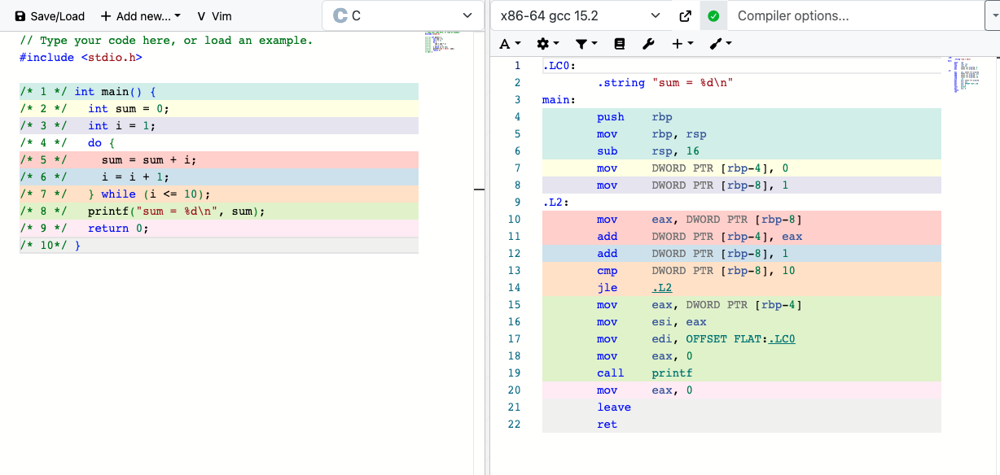

# F.4

## 完成实验手册

### 继续执行上述指令

这里就是从 1-10 的求和，算法总体是让r1从1开始递增，r2作为求和结果寄存器，r3 作为常量1,r0作为常量10，用于和r1做比较

地址7上的指令是一个死循环，因为r3永远不会等于r0。

我用了这个 python 脚本来模拟这个cpu，并且每一步cpu状态打印出来。

```bash
(0,0,0,0,0)
(1,10,0,0,0)
(2,10,0,0,0)
(3,10,0,0,0)
(4,10,0,0,1)
(5,10,1,0,1)
(6,10,1,1,1)
(4,10,1,1,1)
(5,10,2,1,1)
(6,10,2,3,1)
(4,10,2,3,1)
(5,10,3,3,1)
(6,10,3,6,1)
(4,10,3,6,1)
(5,10,4,6,1)
(6,10,4,10,1)
(4,10,4,10,1)
(5,10,5,10,1)
(6,10,5,15,1)
(4,10,5,15,1)
(5,10,6,15,1)
(6,10,6,21,1)
(4,10,6,21,1)
(5,10,7,21,1)
(6,10,7,28,1)
(4,10,7,28,1)
(5,10,8,28,1)
(6,10,8,36,1)
(4,10,8,36,1)
(5,10,9,36,1)
(6,10,9,45,1)
(4,10,9,45,1)
(5,10,10,45,1)
(6,10,10,55,1)
# 之后是一个死循环
(7,10,10,55,1)
(7,10,10,55,1)
(7,10,10,55,1)
(7,10,10,55,1)
(7,10,10,55,1)
(7,10,10,55,1)
...
```

### 10以内的奇数求和

```asm
0: li r0, 9
1: li r1, 1
2: li r2, 0
3: li r3, 2
4: add r2, r2, r1
5: add r1, r1, r3
6: bner0 r1, 4
7: bner0 r3, 7
```

使用我写的 py 脚本进行验证：
```py3
# 验证奇数求和
cpu.run_asm([
" li r0, 11",
" li r1, 1",
" li r2, 0",
" li r3, 2",
" add r2, r2, r1",
" add r1, r1, r3",
" bner0 r1, 4",
" bner0 r3, 7",
])
# 输出如下：
'''
(0,0,0,0,0)
(1,11,0,0,0)
(2,11,1,0,0)
(3,11,1,0,0)
(4,11,1,0,2)
(5,11,1,1,2)
(6,11,3,1,2)
(4,11,3,1,2)
(5,11,3,4,2)
(6,11,5,4,2)
(4,11,5,4,2)
(5,11,5,9,2)
(6,11,7,9,2)
(4,11,7,9,2)
(5,11,7,16,2)
(6,11,9,16,2)
(4,11,9,16,2)
(5,11,9,25,2)
(6,11,11,25,2)
(7,11,11,25,2)
(7,11,11,25,2)
(7,11,11,25,2)
(7,11,11,25,2)
(7,11,11,25,2)
(7,11,11,25,2)
(7,11,11,25,2)
(7,11,11,25,2)
(7,11,11,25,2)
(7,11,11,25,2)
(7,11,11,25,2)
(7,11,11,25,2)
(7,11,11,25,2)
(7,11,11,25,2)
(7,11,11,25,2)
(7,11,11,25,2)
(7,11,11,25,2)
(7,11,11,25,2)
(7,11,11,25,2)
(7,11,11,25,2)
(7,11,11,25,2)
'''
```
结果符合预期

### 在线运行C程序环境

收藏一下： <https://godbolt.org/>

### 继续执行上述c程序

```c
#include <stdio.h>

/* 1 */ int main() {
/* 2 */   int sum = 0;
/* 3 */   int i = 1;
/* 4 */   do {
/* 5 */     sum = sum + i;
/* 6 */     i = i + 1;
/* 7 */   } while (i <= 10);
/* 8 */   printf("sum = %d\n", sum);
/* 9 */   return 0;
/* 10*/ }
```

```bash
PC sum i
(5, 1, 2)
(6, 3, 2)
(7, 3, 3)
(5, 3, 3)
(6, 6, 3)
(7, 6, 4)
(5, 6, 4)
(6, 10, 4)
(7, 10, 5)
(5, 10, 5)
(6, 15, 5)
(7, 15, 6)
(5, 15, 6)
(6, 21, 6)
(7, 21, 7)
(5, 21, 7)
(6, 28, 7)
(7, 28, 8)
(5, 28, 8)
(6, 36, 8)
(7, 36, 9)
(5, 36, 9)
(6, 45, 9)
(7, 45, 10)
(5, 45, 10)
(6, 55, 10)
(7, 55, 11)
(8, 55, 11)
(9, 55, 11)
(10, 55, 11)
```

### 从状态机视角理解数列求和电路的工作过程

我的数列求和实现和第一个实验是一模一样的。
有一个常量1作为常量r3，一个8位寄存器作为递增的r1,一个存结果的寄存器作为r2。 
目前没有的是r0，就是和10进行比较的寄存器。

### 结合数列求和的例子理解编译器的工作

状态转移是一致的，compiler是把c中的变量和pc映射到了isa中的pc和寄存器中。（针对本例子）

### 在Compiler Explorer中理解编译器的工作



## 实验感受

这章节内容不安宁，但是有很多理论推导。对我来说，可能现阶段更需要提炼出这种能力。更像是矩阵中秩的概念，介绍了这个事物的本质。

不理解事物的本质，不影响使用这个事物，但是有这种总结的能力，才能让自己从1拓展到100。