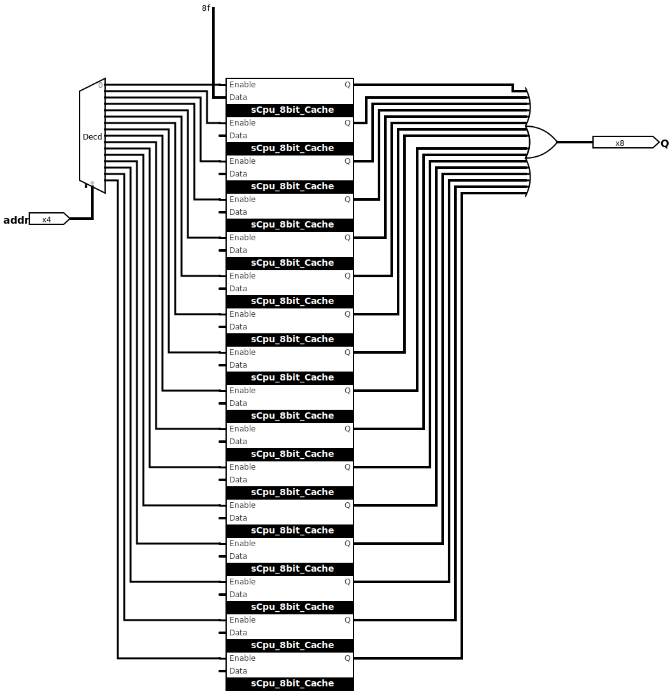
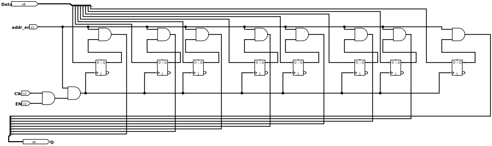
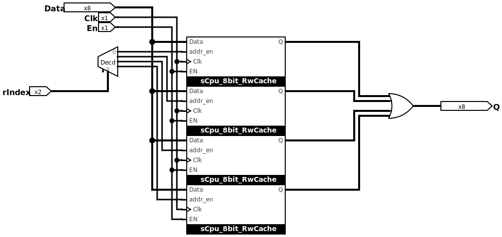
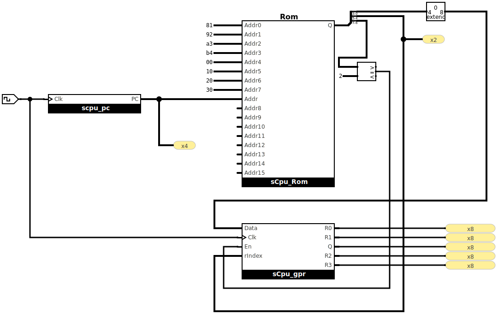
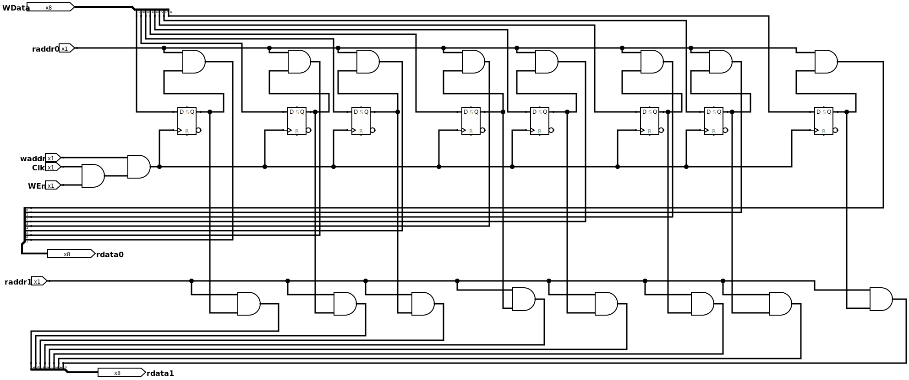
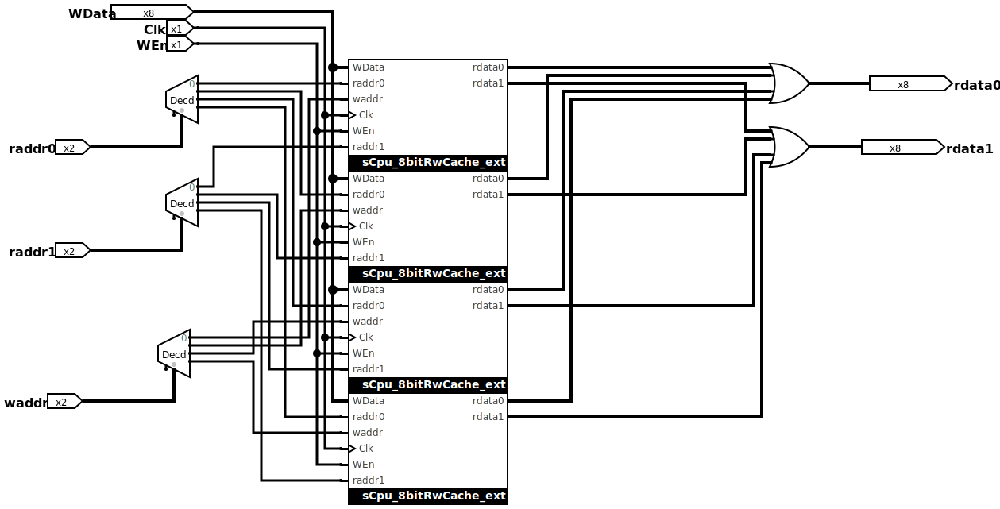
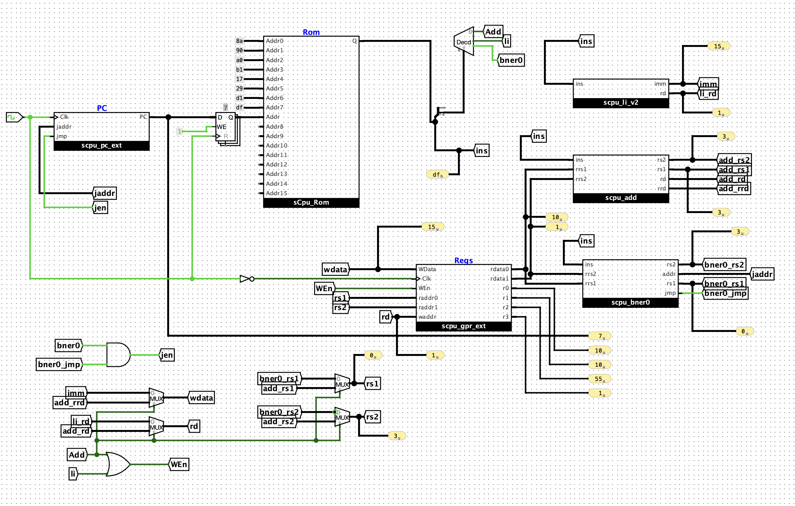
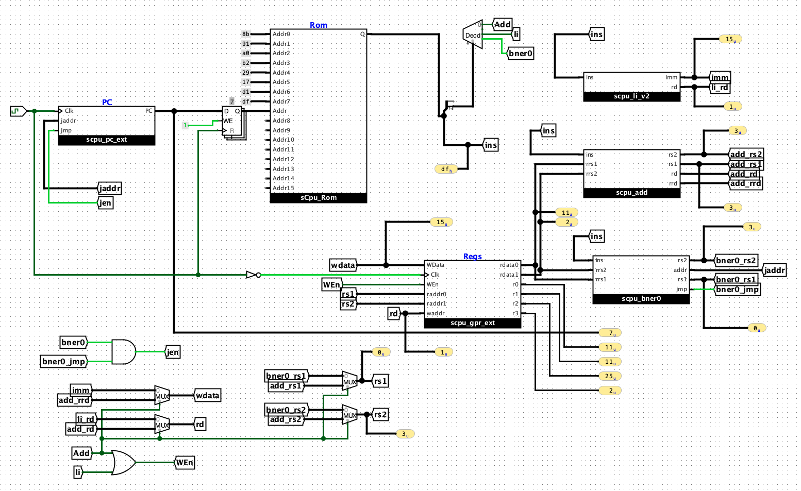
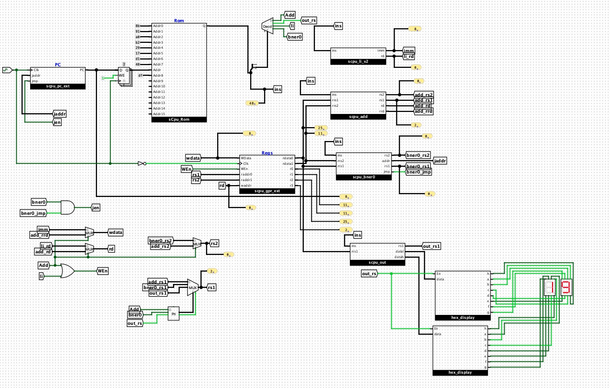

# F.5

## 实现 `sCPU` 的取指功能

首先获取下面两个条件：

1. 可以看到，指令宽度为8bit
2. PC 位宽为4bit

所以设计的rom应该是 16 * 8

如下：

首先设计了8bit的cache，可以实现载入数据，然后当enable时，输出对应的值


然后就是重复的连线工作，最后将16个输出进行or操作就可以了



此外，我还在 地址0 上手动的载入了常量 0x8f, 对应二进制为 0b1000_1111，也就是给 `li r0, 0xf` 的字节码

## 实现GPR以及写入功能

同样的，先实现了8bit的rwcache，可以实现载入数据，不过这个数据是受clk和enable控制的。

由于自带的库中的 D latch没有使能口，所以将使能与CLK进行了and。

如下：



由于gpr一共有四个，所以我这里用4选一 demuxer就可以了。



## 实现仅支持li指令的sCPU

思路如下：

对于每一个clk，
1. 首先根据当前pc从rom中提取出指令
2. 从指令中提取出 指令类型，操作数。对于 `li` 命令，是寄存器的idx和立即数 imm
3. 将 idx 寄存器中的值保存为 imm
4. pc += 1

实现如下：

> 前面四个指令是把 1，2，3，4分别 `li` 到 `r0-r3` 中，后面四个则是读r0和r4(`w_en` 只会在 `li` 指令时被使能)



## 添加 `add` 指令

### 扩展GPR，使得具有两个读端口，一个写端口
如下：

先扩展cache



再扩展 gpr



### 实现 `add` 子指令

将add逻辑实现为一个最小电路，给出输入和输出


## 添加 `bner0` 指令

同 `add` 命令，实现为一个最小电路


## 验证求和电路：
首先我先用我的脚本将前面的asm dump 到hex（asm_to_hex函数），如下：
['0x8a', '0xa0', '0xb1', '0x17', '0x29', '0xd1', '0xdf']

load 到rom中执行，得到：




### 碰到一个问题1：
初始状态 (0,0,0,0,0) 时，实际数据还没有 load 到寄存器中（因为寄存器写入也依赖pc的clock），而在下一个tick时，pc又变为了1。

也就是说pc=0时的指令没有完全执行，马上就变成了 `pc=1` 上的指令。

嗯，我通过加了一个指令寄存器来解决这个问题，具体的来说，就是指令寄存器寄存一下上一刻的 `PC` .

### 碰到问题2:

add指令，按照道理首先要取出rs1和rs2寄存器中的值，然后写入到rd中。但是写入这个时机发生在clk的上升沿。

但是由于指令也是在clk上升沿才load的，所以实际上这次 store 的值大概率是上次指令的结果。

根本问题是，add指令没有在上升沿到来之前把数据都准备好。也就是说，读端口有一定延迟。

所以我让GPR设备的写入在 `CLK` 的下降沿触发。这个时候数据就稳定了。


## 和数列求和电路比对

数列求和电路更简单，但除了求和功能，别的功能都是没有的。这种 `scpu` 的架构虽然复杂，但使得可编程成为可能。

## 计算10以内的奇数之和

复用 `F.4` 写的汇编

```py3
prog2 = [
" li r0, 11",
" li r1, 1",
" li r2, 0",
" li r3, 2",
" add r2, r2, r1",
" add r1, r1, r3",
" bner0 r1, 4",
" bner0 r3, 7",
]
```

dump 为 hex，然后导入到我的rom中

rom = ['0x8b', '0x91', '0xa0', '0xb2', '0x29', '0x17', '0xd1', '0xdf']

电路最终状态：



终态与脚本验证结果一致。`(7,11,11,25,2)`

## 添加 `out rs` 指令

指令格式
```txt
 7  6 5  4 3   2 1   0
 +----+----+-----+-----+
 | 01 | 00 | rs1 | 00 |    out 指令，读取 rs1 寄存器中的数据, 然后将这个寄存器中的值编码为两个7位数码管格式
 +----+----------+-----+
```

使用程序:

```asm
" li r0, 11",
" li r1, 1",
" li r2, 0",
" li r3, 2",
" add r2, r2, r1",
" add r1, r1, r3",
" bner0 r1, 4",
" out r2",
" bner0 r3, 7",
```

scpu在最后反复执行 `out r2, bner0 r3, 7`， 这样就能看到奇数数列求和的结果以16进制显示在数码管中。

验证如下：



## 能设计一条让10个数相加的指令吗?

很显然，如果真的有这么一条指令，要么：
1. 这条指令需要接收 10 个参数，这种情况下指令长度就太长了。这种情况就不太合理
2. 约定好这 10 个数遵循一定的规律，比如说依次递增x，那么指令可以设计成 `add10 rd, rs1, rs2` . 
   其中 rs1 中存着开始的数，rs2中存着增量。那么这种情况下，我觉得是可行的。不过如果真的是这种简单的等差数列，用数列求和公式会不会更快？