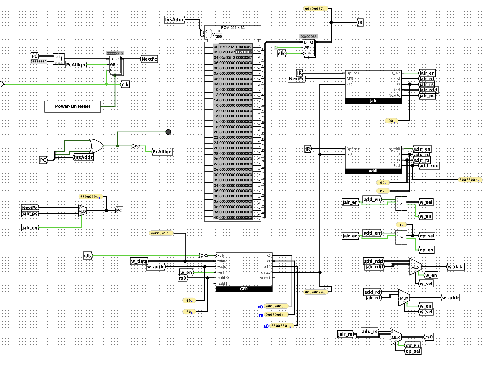

# F.6 Mini-RiscV

## 通过RTFM初步了解RISC-V指令集

RV32I在 Chapter 2 中被介绍。

1. PC寄存器的位宽是多少?
    > 32 位

2. GPR共有多少个? 每个GPR的位宽是多少?
    > GP一共有32个，每个GPR的位宽是32bit。
3. R[0]和sISA的R[0]有什么不同之处?
    > rv32I 的R[0] 固定是0。
4. 指令编码的位宽是多少? 指令有多少种基本格式?
    > In the base RV32I ISA, there are four core instruction formats (R/I/S/U). All are a fixed 32 bits in length. 对于立即数，还有B/J的变种编码格式。
5. 在指令的基本格式中, 需要多少位来表示一个GPR? 为什么?
   > 按照 intruction format, 需要5个位来表示一个GPR，因为一共有32个GPR，2^5 = 32。
6. add指令的格式具体是什么?
   > 汇编指令是 `add rd,rs1,rs2`, 编码格式如下
   `0000000 rs2 rs1 000 rd 0110011`

7. 还有一种基础指令集称为RV32E, 它和RV32I有什么不同?
    > For resource-constrained embedded applications, we have defined the RV32E subset, which only has 16 registers

##  RTFM(2)

- addi指令的编码和相应的功能描述
    `addi rd,rs1, $imm` 将 立即数imm 按照符号扩展之后，与rs1中的值进行相加，将结果存在 rd 寄存器中
- addi 编码
    `imm[11:0] rs1 000 rd 0010011`

## RTFM(3)

1.4 其实没有说明存储器具体需要多大，只是说了PC的 address space是 [0, 0xffffffff]。

对于宽度的定义，规定一个 word 是 4 Bytes，halfword 是 2bytes, double world 是 8bytes, quadword 是 16Bytes

## RTFM(4)

`jalr` 指令的编码和相应的功能描述

`imm[11:0] rs1 000 rd 1100111`

功能描述： 让pc跳转到 （符号扩展的立即数 + [rs1] ） & （～0x1） 的地址上，然后并且把原来 pc + 4 的地址保存到 rd 寄存器中

## 实现两条指令的minirv处理器. `addi` 与 `jalr`

实现如下：

### 实现的功能

把x1当作 ra 寄存器， 使用函数调用的方式(类比)，计算了 10 + 20 的结果，保存在 a0 寄存器中（实际上是x10寄存器,结果应该是0x1e，也就是30），最后程序halt在0xc处。

### 增大立即数的范围验证扩展

把第一条指令改为， `addi	a0,zero,-9`，对应的机器码是 `0xff700503` 改到rom中，运行，最终a0中应该存着 0x1，验证如下：

### 记录的问题

尝试对之前实现的 scpu 进行修改，因为我发现之前的实现中实际上两个 tick 才执行一条指令。是因为我对PC再次进行了寄存，导致pc实际上要过两个周期才更新一次。

做了以下修改：

1. 我加入了正确的IR（之前理解的ir有错，ir是对指令的寄存，而不是对pc的寄存）。
2. 对PC取指做了dw对齐校验，不齐时整个程序会halt
3. PC 选自于 `jalr` 指令和 自增的 `NextPc`，而不是让结果重新进入寄存器中。

## Ref

- Risc-V 手册： <https://github.com/riscv/riscv-isa-manual/releases/download/20240411/unpriv-isa-asciidoc.pdf>