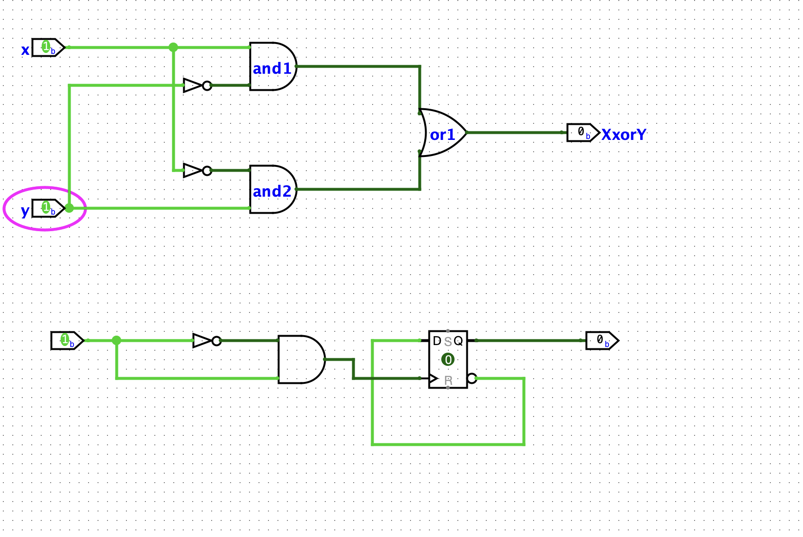
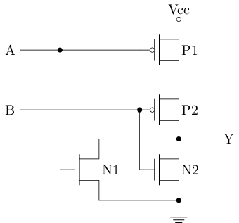
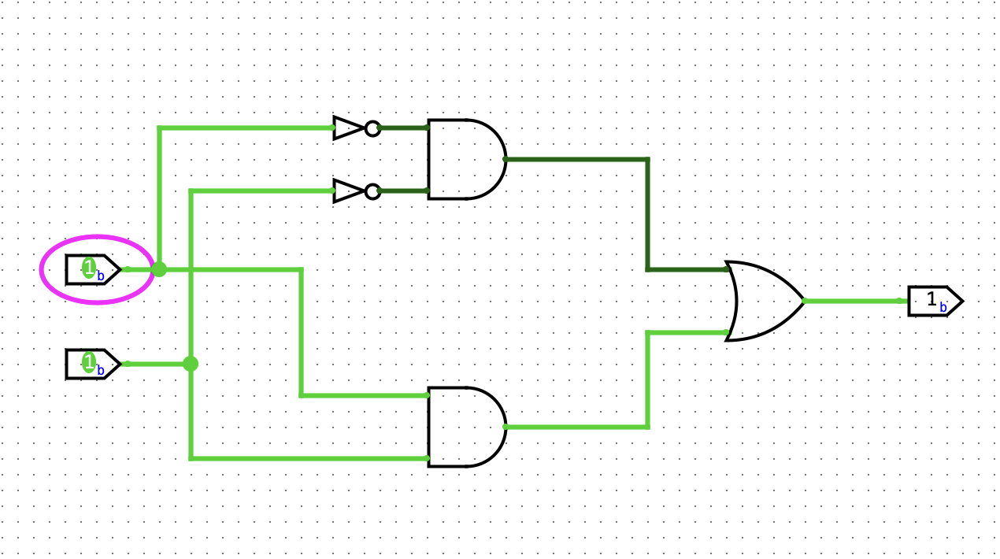
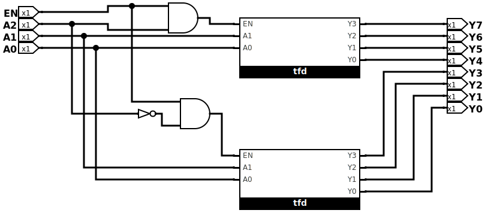
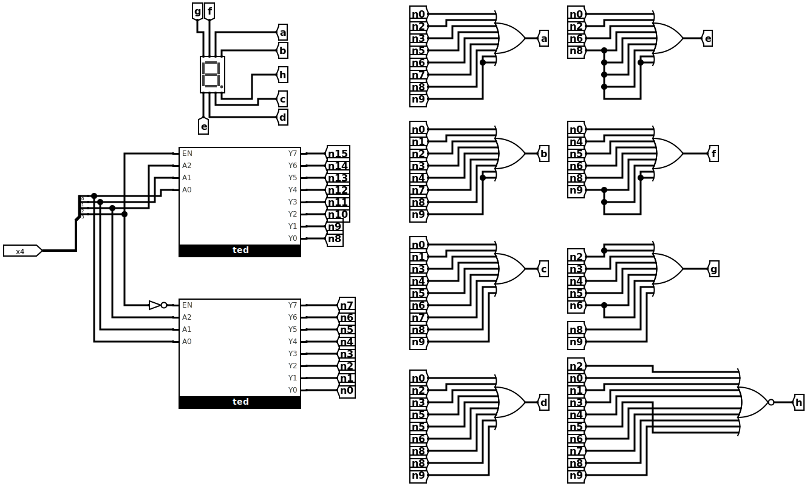
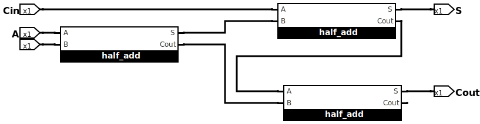
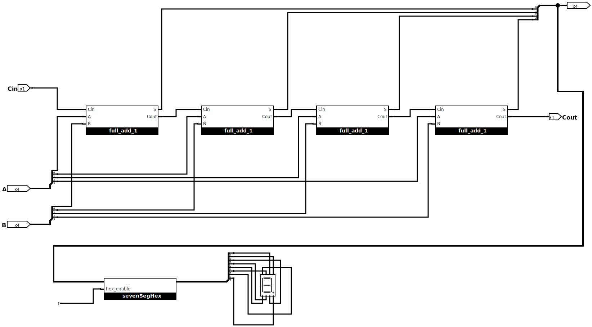

# 预学习

## F.1

### 基础情况介绍
先要做一个[通识问卷](https://www.wenjuan.group/s/UZBZJv6ci37/), 讲诉一生一芯的一些基本情况。

[结果](https://www.wenjuan.group/assess/exam/exam_result/64a3494ed0af5830165d1204?pid=64a3494ed0af5830165d1204&rid=69a931bfeec1bcaa926f82d4&from_source=answer)

### 提问的技巧

嗯，这个很好。可能在学校里问老师多蠢的问题都可以，但是去社会上这个干很可能会导致自己人缘不好。
写了一些感想：

提问是双向的，对于已经工作的人来说，更是如此。对于一个问题，如果没有仔细思考过/尝试过就把它抛给别人，是很不负责的，往远了说，这种人的人际关系也是不咋地的。
对于一个问题，首先应该去自己思考，方式包括 STFW, RTFM, RTFSC，当然，现在还包括问AI。但不建议一上来就问AI，因为万一出现了幻觉现象，可能会导致后面的努力全白费，对于一个问题，应该有一些最基础的认知，再进行后续的工作，会使得对方(无论是ai或者资深工程师)产生错误输出的概率低很多。

## F.2

### logisim 安装与使用

在我的mac电脑上通过 `wget https://github.com/logisim-evolution/logisim-evolution/releases/download/v4.1.0/logisim-evolution-4.1.0-aarch64.dmg` 然后就能够顺利运行了。

### 三个实验
- 阅读guide

然后通过 RTFM 实现了教程中的两个电路。


- io library
  - button: 开关，和输出好像差不多
  - DIP switch: 文档好像没有，应该是拨码器
  - joystick: 两个若干bit的数据，（x,y）代表这个杆子的位置
  - led: 灯
  - led rgb: rgb 灯
  - keyboard: 键盘
  - 7-segment Display: 数码管
  - hex digit display: 16进制数码管
  - led matrix: led 矩阵
  - tty: 串口

- 实现有趣的电路

说实话，没有什么想法，先留空吧。

## F.3 数字电路基础

前言：大学里学过数电，所以对我来说可能更多的是复习，笔记不一定很全。但是学的时间很久了，大概八年前，所以实验作业也不一定对，仅供参考。

### 基础门电路

#### 实验

- 分析门电路



| A | B | Y |
| --- | --- | --- |
| 0 | 0 | 1 |
| 0 | 1 | 0 |
| 1 | 0 | 0 |
| 1 | 1 | 0 |


我记得有个什么方法可以算这种的，但现在忘了，好在这里一眼就看出来了。应该叫它或非门。

**Y = ~(A|B) or Y = (~A) & (~B)**


- 设计或门
只需要在上面的实验输出后面再加上一个非门，就可以实现或门。

- 分析三输入与非门晶体管数量

方案一: 通过一个与门与一个与非门实现。按照前面的课程，一个与门需要6个晶体管，一个与非门需要4个晶体管，那么一共需要10个晶体管。

方案二: 通过晶体管搭建。需要6个晶体管。

- 搭建异或门及对应晶体管数量

这个在我F.2的guide阶段就已经做了，所以就不重复了。用了两个非门，两个与门，一个或门。按照我们实现的或门(或非门+非门=5个晶体管)来算的话，一共用了 `2 * 1 + 6 * 2 +  5 = 19` 个晶体管。

- 搭建同或门

可以简单的通过在 异或 门后面加一个 非门，但是我想通过真值表来试试看先。

| A | B | C |
| --- | --- | --- |
| 0 | 0 | 1 |
| 1 | 1 | 1 |
| 0 | 1 | 0 |
| 1 | 0 | 0 |

算出来
**Y=(~A&~B)|(A&B)**



#### 理论知识
- 真值表

原来我前面不知不觉中使用的方法是叫真值表，而通过真值表得出逻辑表达式的方法如下：

对所有输出为1的表项，将将每一个输入都变为1（取反或者不取反）后，进行或操作就是我们需要的表达式。

为什么是对的？因为输出要么为0，要么为1。将所有可能使得输出为1的可能进行 合并(或) 操作之后，得到的就是正确的表达式了。

### 二进制和十六进制

这个我会，就不记了。

### 组合逻辑电路
工作都放[这儿](./works/F3.combine.circ)


#### 译码器

##### 2-4 译码器

首先求出 Y0-Y3 的输出。

```py3
Y3 = A1 & A0
Y2 = A1 & ~A0
Y1 = ~A1 & A0
Y0 = ~A1 & ~A0
```
搭建如下，加了一个使能脚，主要是为了后面的3-8译码器使用


##### 子电路功能

看 2-4 译码器扩展为 3-8 译码器的操作。就是一个 circuit 作为一个模块。

##### 把2-4译码器拓展为3-8译码器

搭建如下，同样的，也有一个使能脚。



##### 转码器 - 是一种特殊的译码器

定义： 可以按照指定的规则将一种编码的输入转换成另一种编码的输出。


##### 七段数码管译码器1

下面是七段数码管的引脚与显示的对应关系图。

```txt
   a
  ---
f| g |b
  ---
e|   |c
  ---    .h
   d
```

得出真值表

|数字| b3 | b2 | b1 | b0 | a | b | c | d | e | f | g | h |
| --- | --- | --- | --- | --- | --- | --- | --- | --- | --- | --- | --- | --- |
| 0 | 0 | 0 | 0 | 0 | 1 | 1 | 1 | 1 | 1 | 1 | 0 | 0 |
| 1 | 0 | 0 | 0 | 1 | 0 | 1 | 1 | 0 | 0 | 0 | 0 | 0 |
| 2 | 0 | 0 | 1 | 0 | 1 | 1 | 0 | 1 | 1 | 0 | 1 | 0 |
| 3 | 0 | 0 | 1 | 1 | 1 | 1 | 1 | 1 | 0 | 0 | 1 | 0 |
| 4 | 0 | 1 | 0 | 0 | 0 | 1 | 1 | 0 | 0 | 1 | 1 | 0 |
| 5 | 0 | 1 | 0 | 1 | 1 | 0 | 1 | 1 | 0 | 1 | 1 | 0 |
| 6 | 0 | 1 | 1 | 0 | 1 | 0 | 1 | 1 | 1 | 1 | 1 | 0 |
| 7 | 0 | 1 | 1 | 1 | 1 | 1 | 1 | 0 | 0 | 0 | 0 | 0 |
| 8 | 1 | 0 | 0 | 0 | 1 | 1 | 1 | 1 | 1 | 1 | 1 | 0 |
| 9 | 1 | 0 | 0 | 1 | 1 | 1 | 1 | 1 | 0 | 1 | 1 | 0 |
| 其它 | x | x | x | x | 0 | 0 | 0 | 0 | 0 | 0 | 0 | 1 |

求出值关系

```py3
n0 = (~b3&~b2&~b1&~b0) 
n1 = (~b3&~b2&~b1&b0)
n2 = (~b3&~b2&b1&~b0)
n3 = (~b3&~b2&b1&b0)
n4 = (~b3&b2&~b1&~b0)
n5 = (~b3&b2&~b1&b0)
n6 = (~b3&b2&b1&~b0)
n7 = (~b3&b2&b1&b0)
n8 = (b3&~b2&~b1&~b0)
n9 = (b3&~b2&~b1&b0)

# 可以看出来，就是一个 4-16 译码器，我用两个 3-8 译码器搭起来

a = n0 | n2 | n3 | n5 | n6 | n7 | n8 | n9
b = n0 | n1 | n2 | n3 | n4 | n7 | n8 | n9
c = n0 | n1 | n3 | n4 | n5 | n6 | n7 | n8 | n9
d = n0 | n2 | n3 | n5 | n6 | n8 | n9
e = n0 | n2 | n6 | n8 
f = n0 | n4 | n5 | n6 | n8 | n9
g = n2 | n3 | n4 | n5 | n6 | n8 | n9
h = ~(n0|n1|n2|n3|n4|n5|n6|n7|n8|n9)

```

最终搭建的电路如下：



##### 七段数码管译码器2

基于上面的再做拓展，就简单了。

```py3
'''
   a
  ---
f| g |b
  ---
e|   |c
  ---    .h
   d
'''
# for i in range(16):
#   ni = 4_16_decoder(i)
# a-g 保持和上面的不变，h 没有用
# 增加使得对应管子亮的数字就行了
a = a | n10 | n12 | n14 | n15 
b = b | n10 | n13
c = c | n10 | n11 | n13
d = d | n11 | n12 | n13 | n14
e = e | n10 | n11 | n12 | n13 | n14 | n15
f = f | n10 | n11 | n12 | n14 | n15
g = g | n10 | n11 | n13 | n14 | n15
```


总体上来说就是加了一个hex拓展。

有一个hex_enable的pin，当使能的时候，> 9 的输入会让晶体管显示 A ~ F.

不使能的时候，> 9 的输入会让晶体管显示为一个点。

#### 编码器

##### 16-4 编码器

啊，这里求真值表就过于复杂了。 从数字0-15, 列举下每一位下出现的bit就可以了。

```py3
Y0 = A1 | A3 | A5 | A7 | A9 | A11 | A13 | A15
Y1 = A2 | A3 | A6 | A7 | A10 | A11 | A14 | A15
Y2 = A4 | A5 | A6 | A7 | A12 | A13 | A14 | A15
Y3 = A8 | A9 | A10 | A11 | A12 | A13 | A14 | A15

```

搭建如下：


#### 多路选择器

##### 1位2选1选择器

这里给出我对这种命名方式的理解：

m位 n选1选择器

代表每一个输入有m位，共 n 个输入，从其中选出一个作为输出，输出也有m位。


##### 3位4选1选择器

3位4选1选择器 就是4个3位输入，从中选出一路作为输出。

具体实现如下：


##### 可切换进位计数制的七位选择器

这个实际上在我带有 hex 拓展的选择器中就已经做出来了。

这里的思路是，若干个1位2选1选择器。选择信号为拨码开关最高位。其它信号定义为如下：

```py3
h = h if s == 0 else 0
Ai = Ai if s == 1 else 0 # (15>=i>=10)
```
实现在这儿

[hex_enable](#七段数码管译码器2)

#### 搭建4位比较器

如果两个4位二进制数相同，那么点亮LED灯。


#### 加法器

##### 搭建1位全加器

真值表

|A|B|Cin|S| Cout|
| --- | --- | --- | --- | --- |
| 0 | 0 | 0 | 0 | 0 |
| 0 | 0 | 1 | 1 | 0 |
| 0 | 1 | 0 | 1 | 0 |
| 0 | 1 | 1 | 0 | 1 |
| 1 | 0 | 0 | 1 | 0 |
| 1 | 0 | 1 | 0 | 1 |
| 1 | 1 | 0 | 0 | 1 |
| 1 | 1 | 1 | 1 | 1 |

由此可以得出关系
```py3
S = A ^ B ^ Cin
Cout = (A&B) | (B&Cin) | (A&Cin)
```

搭建如下：


###### 用1位半加器搭建1位全加器

先搭建出来半加器


用数学进行分析：

- 首先 A 和 B 进行半家，得到进位C1和S1
- S1要输入Cin再次进行一次半加，得到进位C2和S2
- 最终的S肯定为S2，而最终的C可以是C1和C2半加结果的S，也可以是C1|C2(因为C1和C2肯定不会同时为1)，也可以是C1^C2。

我这里最终的C是从C1和C2的半加来的。



##### 搭建4位全加器和校验

