# 预学习

## F.1

### 基础情况介绍
先要做一个[通识问卷](https://www.wenjuan.group/s/UZBZJv6ci37/), 讲诉一生一芯的一些基本情况。

[结果](https://www.wenjuan.group/assess/exam/exam_result/64a3494ed0af5830165d1204?pid=64a3494ed0af5830165d1204&rid=69a931bfeec1bcaa926f82d4&from_source=answer)

### 提问的技巧

嗯，这个很好。可能在学校里问老师多蠢的问题都可以，但是去社会上这个干很可能会导致自己人缘不好。
写了一些感想：

提问是双向的，对于已经工作的人来说，更是如此。对于一个问题，如果没有仔细思考过/尝试过就把它抛给别人，是很不负责的，往远了说，这种人的人际关系也是不咋地的。
对于一个问题，首先应该去自己思考，方式包括 STFW, RTFM, RTFSC，当然，现在还包括问AI。但不建议一上来就问AI，因为万一出现了幻觉现象，可能会导致后面的努力全白费，对于一个问题，应该有一些最基础的认知，再进行后续的工作，会使得对方(无论是ai或者资深工程师)产生错误输出的概率低很多。

## F.2

### logisim 安装与使用

在我的mac电脑上通过 `wget https://github.com/logisim-evolution/logisim-evolution/releases/download/v4.1.0/logisim-evolution-4.1.0-aarch64.dmg` 然后就能够顺利运行了。

### 三个实验
- 阅读guide

然后通过 RTFM 实现了教程中的两个电路。


- io library
  - button: 开关，和输出好像差不多
  - DIP switch: 文档好像没有，应该是拨码器
  - joystick: 两个若干bit的数据，（x,y）代表这个杆子的位置
  - led: 灯
  - led rgb: rgb 灯
  - keyboard: 键盘
  - 7-segment Display: 数码管
  - hex digit display: 16进制数码管
  - led matrix: led 矩阵
  - tty: 串口

- 实现有趣的电路

说实话，没有什么想法，先留空吧。

## F.3 数字电路基础

前言：大学里学过数电，所以对我来说可能更多的是复习，笔记不一定很全。但是学的时间很久了，大概八年前，所以实验作业也不一定对，仅供参考。

后面发现可以记录工作，于是把作业都放[这儿](./works/F3.combine.circ)


### 基础门电路

#### 实验

- 分析门电路


| A | B | Y |
| --- | --- | --- |
| 0 | 0 | 1 |
| 0 | 1 | 0 |
| 1 | 0 | 0 |
| 1 | 1 | 0 |


我记得有个什么方法可以算这种的，但现在忘了，好在这里一眼就看出来了。应该叫它或非门。

**Y = ~(A|B) or Y = (~A) & (~B)**


- 设计或门
只需要在上面的实验输出后面再加上一个非门，就可以实现或门。

- 分析三输入与非门晶体管数量

方案一: 通过一个与门与一个与非门实现。按照前面的课程，一个与门需要6个晶体管，一个与非门需要4个晶体管，那么一共需要10个晶体管。

方案二: 通过晶体管搭建。需要6个晶体管。

- 搭建异或门及对应晶体管数量

这个在我F.2的guide阶段就已经做了，所以就不重复了。用了两个非门，两个与门，一个或门。按照我们实现的或门(或非门+非门=5个晶体管)来算的话，一共用了 `2 * 1 + 6 * 2 +  5 = 19` 个晶体管。

- 搭建同或门

可以简单的通过在 异或 门后面加一个 非门，但是我想通过真值表来试试看先。

| A | B | C |
| --- | --- | --- |
| 0 | 0 | 1 |
| 1 | 1 | 1 |
| 0 | 1 | 0 |
| 1 | 0 | 0 |

算出来
**Y=(~A&~B)|(A&B)**


#### 理论知识
- 真值表

原来我前面不知不觉中使用的方法是叫真值表，而通过真值表得出逻辑表达式的方法如下：

对所有输出为1的表项，将将每一个输入都变为1（取反或者不取反）后，进行或操作就是我们需要的表达式。

为什么是对的？因为输出要么为0，要么为1。将所有可能使得输出为1的可能进行 合并(或) 操作之后，得到的就是正确的表达式了。

### 二进制和十六进制

这个我会，就不记了。

### 组合逻辑电路

#### 译码器

##### 2-4 译码器

首先求出 Y0-Y3 的输出。

```py3
Y3 = A1 & A0
Y2 = A1 & ~A0
Y1 = ~A1 & A0
Y0 = ~A1 & ~A0
```
搭建如下，加了一个使能脚，主要是为了后面的3-8译码器使用


##### 子电路功能

看 2-4 译码器扩展为 3-8 译码器的操作。就是一个 circuit 作为一个模块。

##### 把2-4译码器拓展为3-8译码器

搭建如下，同样的，也有一个使能脚。


##### 转码器 - 是一种特殊的译码器

定义： 可以按照指定的规则将一种编码的输入转换成另一种编码的输出。


##### 七段数码管译码器1

下面是七段数码管的引脚与显示的对应关系图。

```txt
   a
  ---
f| g |b
  ---
e|   |c
  ---    .h
   d
```

得出真值表

|数字| b3 | b2 | b1 | b0 | a | b | c | d | e | f | g | h |
| --- | --- | --- | --- | --- | --- | --- | --- | --- | --- | --- | --- | --- |
| 0 | 0 | 0 | 0 | 0 | 1 | 1 | 1 | 1 | 1 | 1 | 0 | 0 |
| 1 | 0 | 0 | 0 | 1 | 0 | 1 | 1 | 0 | 0 | 0 | 0 | 0 |
| 2 | 0 | 0 | 1 | 0 | 1 | 1 | 0 | 1 | 1 | 0 | 1 | 0 |
| 3 | 0 | 0 | 1 | 1 | 1 | 1 | 1 | 1 | 0 | 0 | 1 | 0 |
| 4 | 0 | 1 | 0 | 0 | 0 | 1 | 1 | 0 | 0 | 1 | 1 | 0 |
| 5 | 0 | 1 | 0 | 1 | 1 | 0 | 1 | 1 | 0 | 1 | 1 | 0 |
| 6 | 0 | 1 | 1 | 0 | 1 | 0 | 1 | 1 | 1 | 1 | 1 | 0 |
| 7 | 0 | 1 | 1 | 1 | 1 | 1 | 1 | 0 | 0 | 0 | 0 | 0 |
| 8 | 1 | 0 | 0 | 0 | 1 | 1 | 1 | 1 | 1 | 1 | 1 | 0 |
| 9 | 1 | 0 | 0 | 1 | 1 | 1 | 1 | 1 | 0 | 1 | 1 | 0 |
| 其它 | x | x | x | x | 0 | 0 | 0 | 0 | 0 | 0 | 0 | 1 |

求出值关系

```py3
n0 = (~b3&~b2&~b1&~b0) 
n1 = (~b3&~b2&~b1&b0)
n2 = (~b3&~b2&b1&~b0)
n3 = (~b3&~b2&b1&b0)
n4 = (~b3&b2&~b1&~b0)
n5 = (~b3&b2&~b1&b0)
n6 = (~b3&b2&b1&~b0)
n7 = (~b3&b2&b1&b0)
n8 = (b3&~b2&~b1&~b0)
n9 = (b3&~b2&~b1&b0)

# 可以看出来，就是一个 4-16 译码器，我用两个 3-8 译码器搭起来

a = n0 | n2 | n3 | n5 | n6 | n7 | n8 | n9
b = n0 | n1 | n2 | n3 | n4 | n7 | n8 | n9
c = n0 | n1 | n3 | n4 | n5 | n6 | n7 | n8 | n9
d = n0 | n2 | n3 | n5 | n6 | n8 | n9
e = n0 | n2 | n6 | n8 
f = n0 | n4 | n5 | n6 | n8 | n9
g = n2 | n3 | n4 | n5 | n6 | n8 | n9
h = ~(n0|n1|n2|n3|n4|n5|n6|n7|n8|n9)

```

最终搭建的电路如下：


##### 七段数码管译码器2

基于上面的再做拓展，就简单了。

```py3
'''
   a
  ---
f| g |b
  ---
e|   |c
  ---    .h
   d
'''
# for i in range(16):
#   ni = 4_16_decoder(i)
# a-g 保持和上面的不变，h 没有用
# 增加使得对应管子亮的数字就行了
a = a | n10 | n12 | n14 | n15 
b = b | n10 | n13
c = c | n10 | n11 | n13
d = d | n11 | n12 | n13 | n14
e = e | n10 | n11 | n12 | n13 | n14 | n15
f = f | n10 | n11 | n12 | n14 | n15
g = g | n10 | n11 | n13 | n14 | n15
```


总体上来说就是加了一个hex拓展。

有一个hex_enable的pin，当使能的时候，> 9 的输入会让晶体管显示 A ~ F.

不使能的时候，> 9 的输入会让晶体管显示为一个点。

#### 编码器

##### 16-4 编码器

啊，这里求真值表就过于复杂了。 从数字0-15, 列举下每一位下出现的bit就可以了。

```py3
Y0 = A1 | A3 | A5 | A7 | A9 | A11 | A13 | A15
Y1 = A2 | A3 | A6 | A7 | A10 | A11 | A14 | A15
Y2 = A4 | A5 | A6 | A7 | A12 | A13 | A14 | A15
Y3 = A8 | A9 | A10 | A11 | A12 | A13 | A14 | A15

```

搭建如下：


##### 4-2 优先编码器

我一开始的想法是当高位有输入的时候，低位不管是什么都无效。所以我把低位的输入全都 & 了高位的 输入。

这样，当高位有输入时，低位的输入无效，就实现了 优先 的概念。


后面去参考了网上的资料。发现可以用下面的表达式实现

```py3

Y1 = a3 | a2
# 下面这个的意思就是说，当a2 为1，且a1为1的时候，Y0 不能为1，4-2优先编码 也就这一种特殊情况
Y0 = a3 | (~a2 & a1) 
```

搭建为如下：


##### 16-4 优先编码器
```txt
想法是这样的，先把16位数据分成4组。b15-b12,b11-b8,b7-b4,b3-b0。然后依次将它们通过一个4-2优先编码器。

很显然，当b15-b12 有数值A3时，结果应该输出 0xc + A3
否则当 b11-b8 有数值A2时，结果应该输出 0x8 + A2
否则当 b7-b4 有数值A1时，结果应该输出 0x4 + A1
否则当 b3-b0 有数值A0时，结果应该输出 0 + A0

0xc,0x8,0x4,0x0就是 (0x3,0x2,0x1,0x0) <<2 。就是把高组的是否有输出进行一次优先编码。

```

实现如下： 4-2 编码器加了 V 输出，就是对4个输入进行一次或

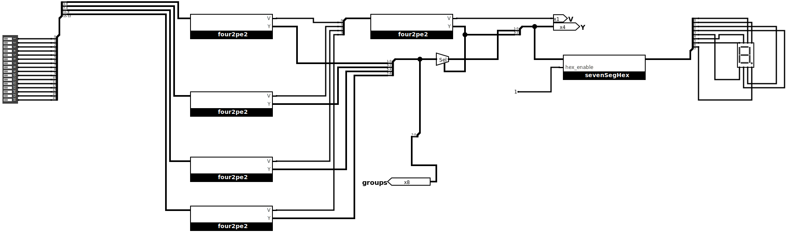

##### 前导0/1的计算

- 前导0的计算：

优先编码器会给出最高位1的数值编码，所以只需要用 输出位数 - 这个数值 就是前面有多少个0的结果了。

比如说 4-2 优先编码器对 `0100` 的处理结果为 2，只需要用 0b11 - 0b10 就得出来 1的结果。

- 前导1的计算：

先取反，然后计算前导0就行了。


#### 多路选择器

##### 1位2选1选择器

这里给出我对这种命名方式的理解：

m位 n选1选择器

代表每一个输入有m位，共 n 个输入，从其中选出一个作为输出，输出也有m位。


##### 3位4选1选择器

3位4选1选择器 就是4个3位输入，从中选出一路作为输出。

具体实现如下：


##### 可切换进位计数制的七位选择器

这个实际上在我带有 hex 拓展的选择器中就已经做出来了。

这里的思路是，若干个1位2选1选择器。选择信号为拨码开关最高位。其它信号定义为如下：

```py3
h = h if s == 0 else 0
Ai = Ai if s == 1 else 0 # (15>=i>=10)
```
实现在这儿

[hex_enable](#七段数码管译码器2)

#### 搭建4位比较器

如果两个4位二进制数相同，那么点亮LED灯。


#### 加法器

##### 搭建1位全加器

真值表

|A|B|Cin|S| Cout|
| --- | --- | --- | --- | --- |
| 0 | 0 | 0 | 0 | 0 |
| 0 | 0 | 1 | 1 | 0 |
| 0 | 1 | 0 | 1 | 0 |
| 0 | 1 | 1 | 0 | 1 |
| 1 | 0 | 0 | 1 | 0 |
| 1 | 0 | 1 | 0 | 1 |
| 1 | 1 | 0 | 0 | 1 |
| 1 | 1 | 1 | 1 | 1 |

由此可以得出关系
```py3
S = A ^ B ^ Cin
Cout = (A&B) | (B&Cin) | (A&Cin)
```

搭建如下：

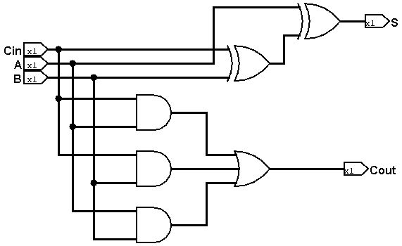

###### 用1位半加器搭建1位全加器

先搭建出来半加器


用数学进行分析：

- 首先 A 和 B 进行半家，得到进位C1和S1
- S1要输入Cin再次进行一次半加，得到进位C2和S2
- 最终的S肯定为S2，而最终的C可以是C1和C2半加结果的S，也可以是C1|C2(因为C1和C2肯定不会同时为1)，也可以是C1^C2。

我这里最终的C是从C1和C2的半加来的。


##### 搭建4位全加器和校验


### 整数的机器码表示

#### 4位减法器

参考4位加法器，得先设计一下1位减法器(a1-a0-borrow)。写出真值表

| A1 | A0 | Bin | D | Bout |
| --- | --- | --- | --- | --- |
|  0 | 0 | 0 | 0 | 0 |
| 0 | 0 | 1 | 1 | 1 |
| 0 | 1 | 0 | 1 | 1 |
| 0 | 1 | 1 | 0 | 1 |
| 1 | 0 | 0 | 1 | 0 |
| 1 | 0 | 1 | 0 | 0 |
| 1 | 1 | 0 | 0 | 0 |
| 1 | 1 | 1 | 1 | 1 |


得出关系：
```py3
D = (~A1 & ~a0 & bin) | (~A1 & a0 & ~bin) | (A1 & ~a0 & ~bin) | (A1 & a0 & bin)
bout = (~A1 & ~a0 & bin) |  (~A1 & a0 & ~bin) | (~A1 & a0 & bin) | (A1 & a0 & bin)
```

搭建出一位全减器,如下:


然后搭建出4位全减器，如下：


验证如图：

0x2 - 0x3 = 0xf, borrow 1
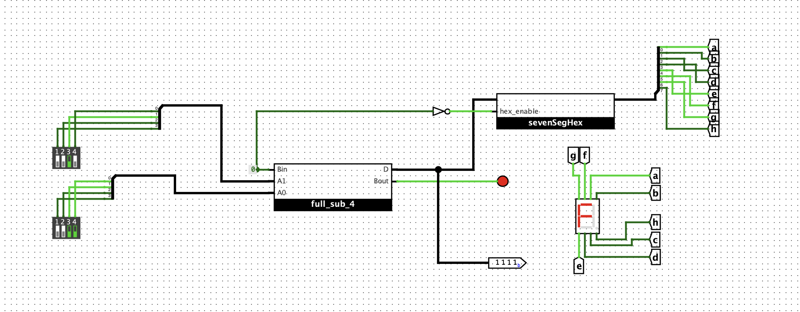


#### 4位原码加法器

按照前面几种情况的分析，计算原码时，首先要选出符号位，然后对剩下的数据位，要么进行加，要么进行减。

具体规则是：

1. 两个正数AB相加: 数据位A3+B3，符号位为0 (00)
2. 大正数A加小负数B: 数据位A3-B3，符号位为0 (01)
3. 小正数A加大负数B: 数据位B3-A3，符号位为1 (10)
4. 两个负数相加，数据位A3+B3，符号位为1 (11)
5. 这里假设了A一定是正数，当A不是正数时，就把A和B换个顺序

这样的话，按下面的进行设计：

- 先把输入进行选择，在输入有正数时，A永远是正数
- 计算出 A3+B3, A3-B3, B3-A3
- 拼凑一下四种输出结果
- 拿出（A4与B4），组合成为 B4A4， 作为选择子，对四种结果进行选择。

设计如下：


验证如下：

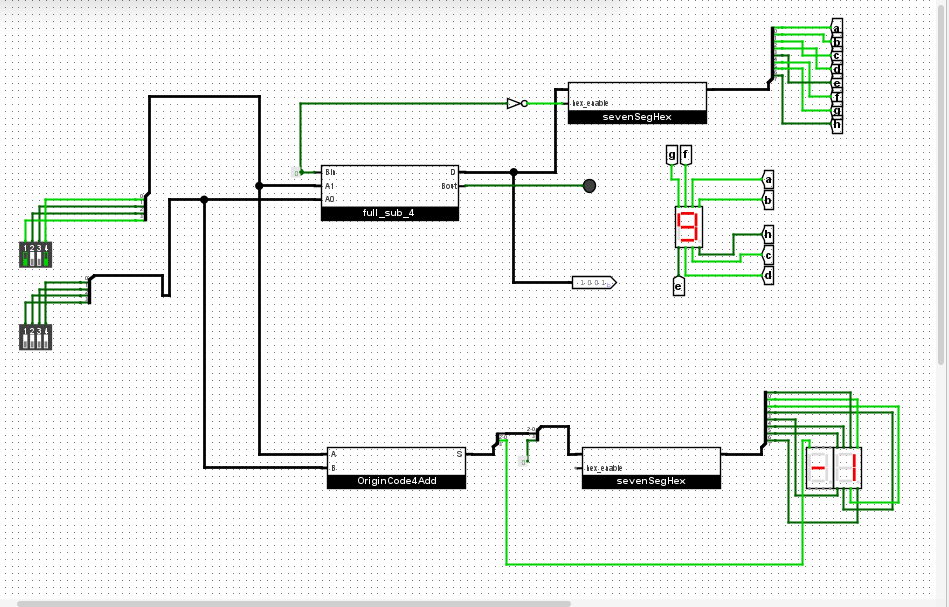


#### 四位反码加法器

按照思路: 先把反码转换为真值等价的原码，然后使用原码加法器计算结果, 再将结果转换为真值等价的反码进行设计。

结果如下：


#### 搭建4位反码加法器(2)

嗯，发现如果是负数的情况下，RCA所得结果再加一个1就是正确结果了。

这就是补码的概念吧。这里就不做了。

#### 补码的疑问

教材中这段证明对我来说很突兀，这是尝试在说明什么问题呢？

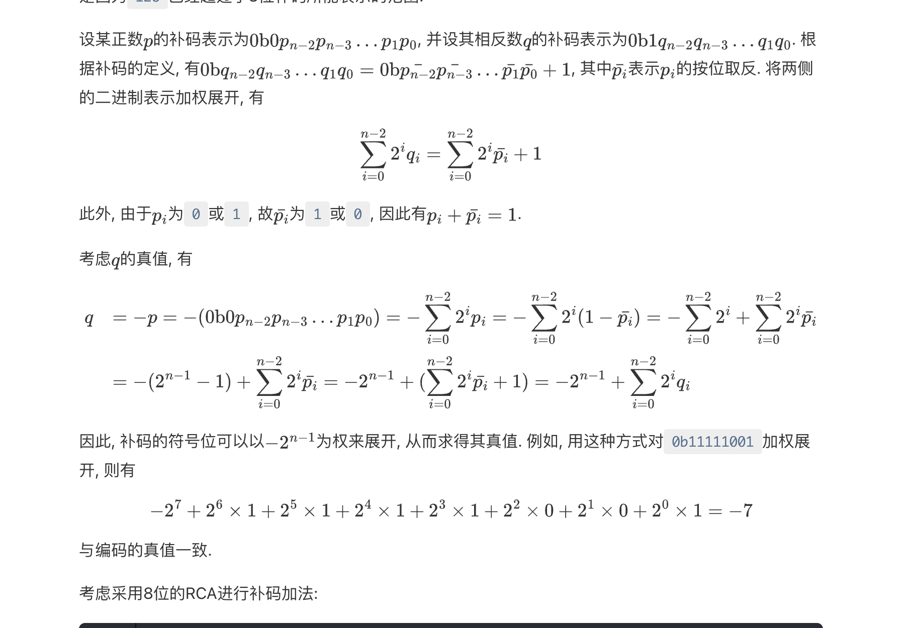

问了 AI 之后，给出的解答是，这是在证明，**为什么补码能够正确表示一个数的值**。

当前正确表示也是有前提的，前提是这个补码最高位（符号位） 要被视为 -2^(n-1) * B(n-1)


#### 检测补码加法是否发生溢出

先得出完整的真值表：

| An-1 | Bn-1 | Cn-1 | Cn | Sn-1 | 溢出 |
| --- | --- | --- | --- | --- | --- |
| 0 | 0 | 0 | 0 | 0 | 否 |
| 0 | 0 | 1 | 0 | 1 | 是 |
| 0 | 1 | 0 | 0 | 1 | 否 |
| 0 | 1 | 1 | 1 | 0 | 否 |
| 1 | 0 | 0 | 0 | 1 | 否 |
| 1 | 0 | 1 | 1 | 0 | 否 |
| 1 | 1 | 0 | 1 | 0 | 是 | 
| 1 | 1 | 1 | 1 | 1 | 否 |

所以 `溢出= An-1&Bn-1&~Sn-1 | ~An-1&~Bn-1&Sn-1`

搭建如下：

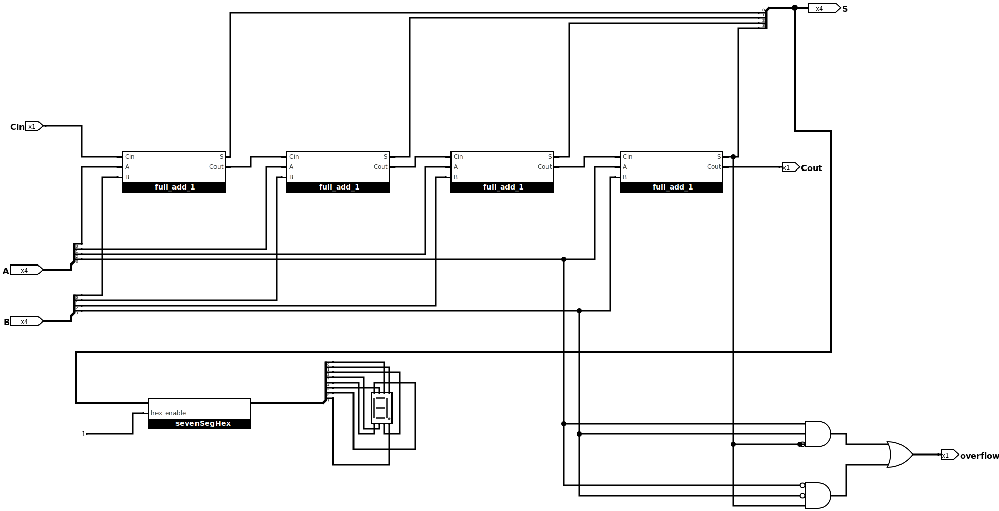

### 时序逻辑电路

####  SR 锁存器

如下


oscillation apparent:

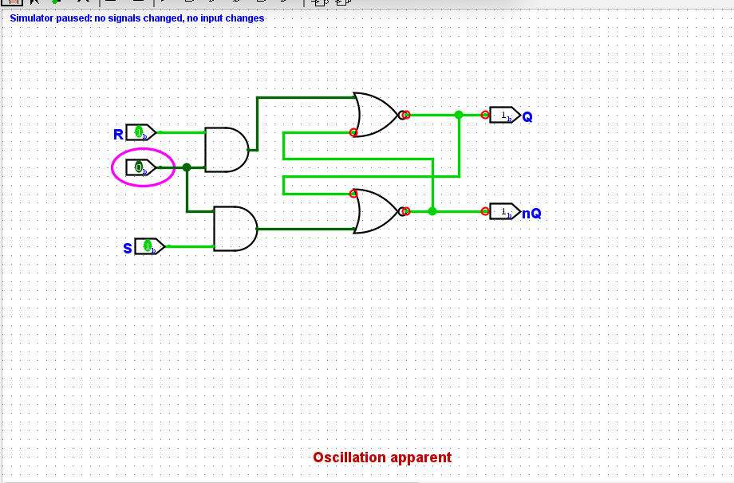


#### ~S~R 锁存器

搭建如下：


行为如下：

1. 当 R 为 0， S 为 1 时，上方与非门输出恒定为1，下方与非门输出恒为0.  此时Q为1, 故将SR锁存器存储的值更新为1。
2. 当 R 为 1， S 为 0 时，下方与非门输出恒定为1，上方输出输出恒为0.  此时Q为0, 故将SR锁存器存储的值更新为0。
3. 当 R 为 1， S 为 1 时，两个与非门的行为和反相器一致。此时锁存器的行为和交叉配对反相器一致, 故SR锁存器将保持之前存储的值。
4. 当 R 为 0 ，S 为 0 时，两个门的输出均为1。并且从 sr 从 00 变为 11 时，锁存器进入震荡的亚稳态。

#### 分析D锁存器的行为

通过分析 WE 是否使能开始：
1. WE 使能，则 S = D， R = not D. 这种情况下如果D是1，那么Q为1; D是0的话, Q为0，也就是说 Q = D.
2. WE 不使能，则S = 0，R = 0. 这种情况下，Q将保持。

就是说，S 和 R 同时为1的情况就不存在了。自然 11 到 00 的跳变也不会存在。

真值表如下：


| WE | D | Q | 
| --- | --- | --- |
| 0 | x | hold |
| 1 | 1 | 1 |
| 1 | 0 | 0 |

#### 搭建D锁存器


#### 带复位功能的D锁存器

这个reset是低电平有效的


#### 用D锁存器实现位翻转功能

D = ~D, 在输入没有变化的时候，输出一直在反转，所以仿真程序认为出现了震荡。


#### D 触发器

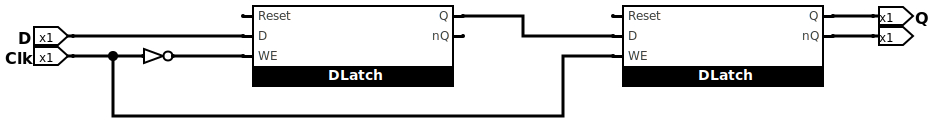

#### 带复位功能的D触发器

将主和子锁存器的Reset连接到Reset信号就可以了


#### D触发器实现位翻转功能

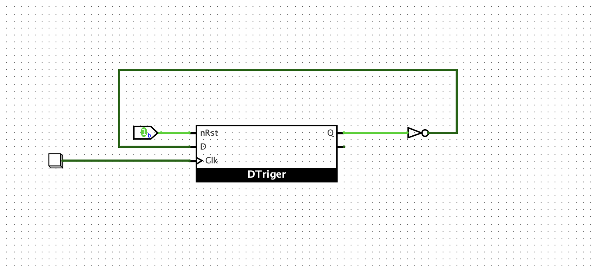

#### 下降沿触发的D触发器

有下面两种方式：

1. 主锁存器的CLK信号输入不取反，子锁存器的CLK信号取反
2. 将上升沿的D触发器的CLK信号取反

#### 搭建带使能端的D触发器

想法是对CLK进行一次 与 操作，就是当 EN 为0时，CLK的变化被忽略。


#### 4位寄存器

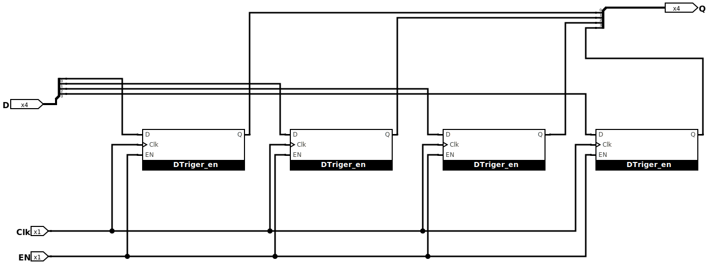

验证如下： 输入的值不会马上生效，必须等到按一下button才会显示在数码管上。

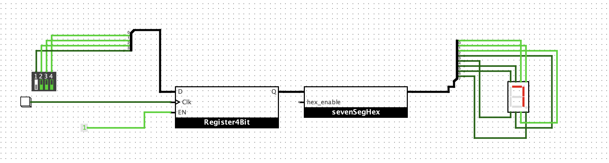

#### 搭建4位计数器

想法是这样的： 每一个 clk 来的时候，v = v + 1。 也就是说，当clk来的时候，寄存器将上一次求和的值刷新到新的Q，然后把这个Q+1作为输入，等待下一次的时钟。

如下：
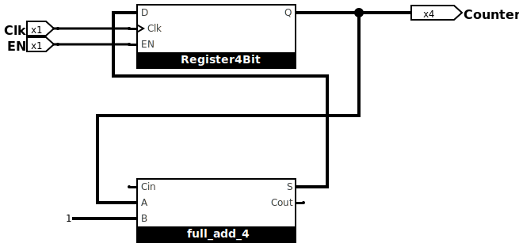

验证如下：
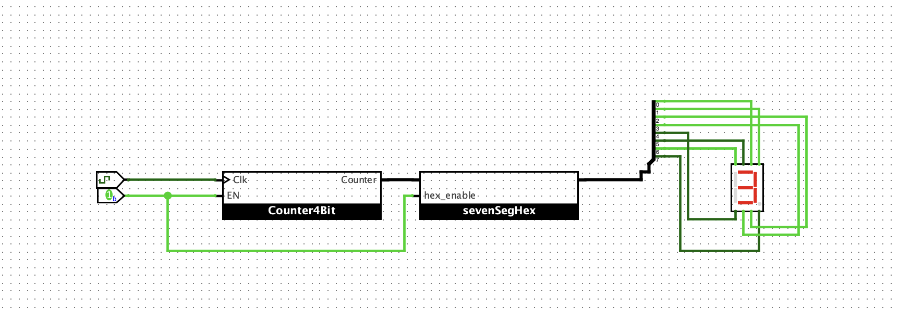

#### 设计数列求和电路
>先前设计的修改
>1. 发现先前设计的sr寄存器有概率仿真开始的时候就出现震荡，所以我在R加了一个 POR 信号。这样就稳定多了
>2. 扩展了8位寄存器和8位全加器
>3. 修正 DLatch, En信号不应该直接与 CLK 信号进行 &，应该与 非/和原始信号分别 &

设计如下：

1. 加数从0开始递增，每一个clock递增1
2. sum初始值为0，每一个clock与加数进行相加
3. 时钟产生10个tick后，输出结果

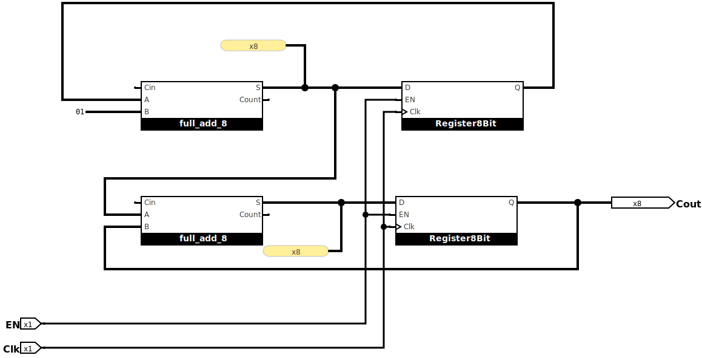

验证如下： 输出 1+2+3+...+10 = 0x37

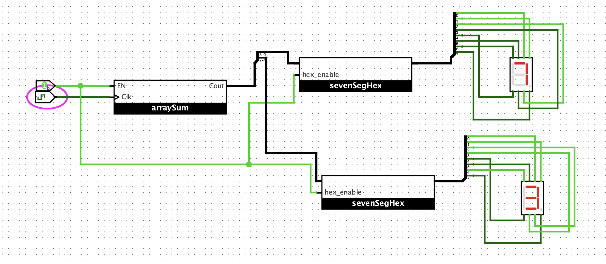

#### 实现电子时钟

想法如下：

1. 2个8位累加器 分别代表 秒和分
2. 设计8位比较器
3. 秒累加器的输出等与60时，产生一次分的clk，让分累加器 +1，然后将秒累加器的输出复位
4. 分累加器的输出等与60时，将分累加器的输出复位

实现如下：

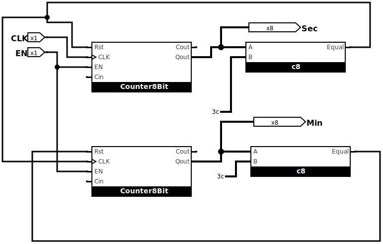

验证如下：

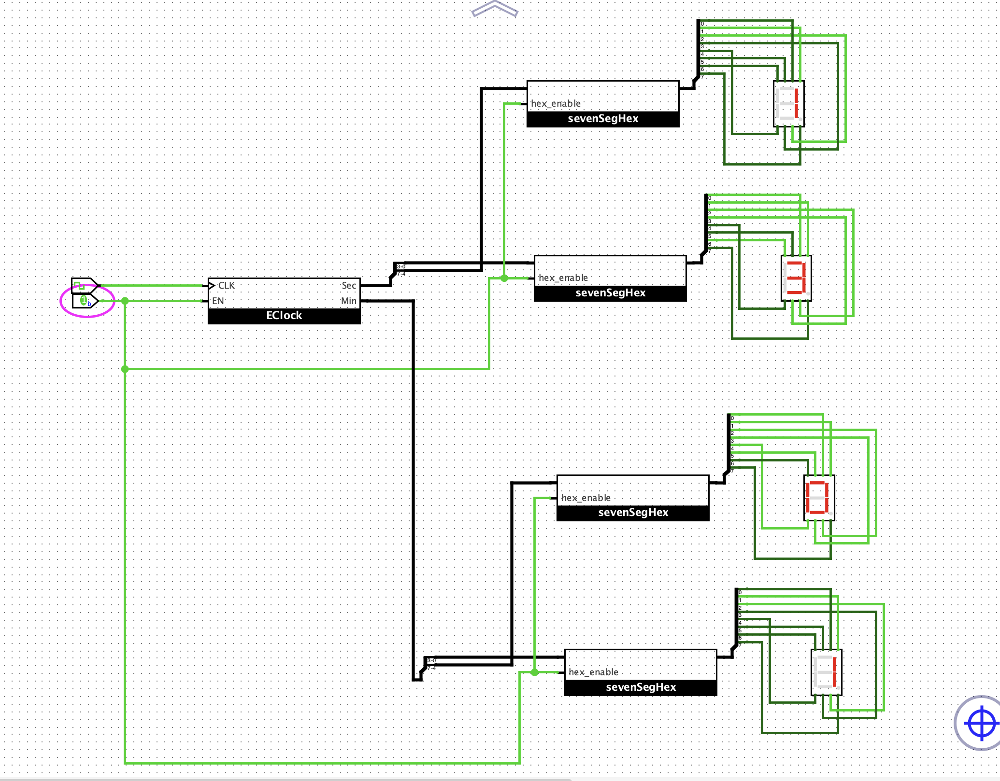

note: 为了方便，我这里没有做10分的显示，用了两个16进制的显示。

attention: 

加了复位电路也没有办法完全解决震荡问题，我的版本如下：
```txt
Product: Logisim-evolution v4.1.0
Runs on: Java HotSpot(TM) 64-Bit Server VM v25.0.2

Compiled: 2026-02-15T09:21:41+0100
Build ID: main/632d66dc
Built on: Java HotSpot(TM) 64-Bit Server VM v25.0.2
```

问了ai，建议是使用内置的srlatch，我单步调试过，貌似目前每一步会吧Q或者～Q的状态置为不确定，然后反复进行计算。

用当前我的电路时，只会在摆电路的时候出现震荡，如果有的话，复位再重新仿真，就不会出现问题。